# Software Design Document (SDD)

## PhucNguyen Resort & Tour Hub

**Version:** 1.0
**Date:** July 2026
**Technology:** ASP.NET Core 8.0 MVC | C# | SQL Server | Entity Framework Core 8.0

---

# Table of Contents

- [1. System Design](#1-system-design)
  - [1.1 Software Architecture](#11-software-architecture)
  - [1.2 Package Diagram](#12-package-diagram)
  - [1.3 Database Design](#13-database-design)
- [2. Detailed Design](#2-detailed-design)
  - [2.1 State Transition Diagrams](#21-state-transition-diagrams)
  - [2.2 Class Diagrams](#22-class-diagrams)
  - [2.3 Sequence Diagrams](#23-sequence-diagrams)

---

# 1. System Design

## 1.1 Software Architecture

### 1.1.1 Architectural Style

PhucNguyen Resort & Tour Hub is implemented as a **Monolithic 3-Tier Web Application** following the **MVC (Model-View-Controller)** pattern provided by ASP.NET Core 8.0.

| Tier                            | Layer                      | Technology                                                 |
| ------------------------------- | -------------------------- | ---------------------------------------------------------- |
| **Tier 1 – Client**      | Web Browser (Presentation) | HTML5, CSS3, JavaScript, jQuery, Bootstrap, SignalR Client |
| **Tier 2 – Application** | Web Server (Logic)         | ASP.NET Core 8.0 MVC, Kestrel, C#                          |
| **Tier 3 – Data**        | Database Server            | Microsoft SQL Server, EF Core 8.0                          |

### 1.1.2 Overall Architecture Diagram

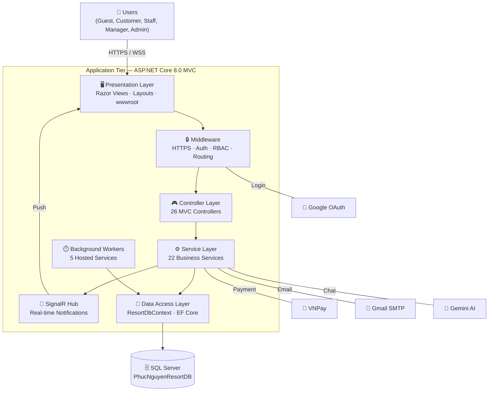
```mermaid
graph TD
    Users["👤 Users\n(Guest, Customer, Staff, Manager, Admin)"]

    subgraph APP["Application Tier — ASP.NET Core 8.0 MVC"]
        direction TB
        PRES["🖥️ Presentation Layer\nRazor Views · Layouts · wwwroot"]
        MW["🔒 Middleware\nHTTPS · Auth · RBAC · Routing"]
        CTRL["🎮 Controller Layer\n26 MVC Controllers"]
        SVC["⚙️ Service Layer\n22 Business Services"]
        BG["⏱️ Background Workers\n5 Hosted Services"]
        RT["📡 SignalR Hub\nReal-time Notifications"]
        DAL["💾 Data Access Layer\nResortDbContext · EF Core"]
    end

    DB[("🗄️ SQL Server\nPhucNguyenResortDB")]

    VNPay["🏦 VNPay"]
    Google["🔐 Google OAuth"]
    Gmail["📧 Gmail SMTP"]
    Gemini["🤖 Gemini AI"]

    Users -->|"HTTPS / WSS"| PRES
    PRES --> MW --> CTRL --> SVC --> DAL --> DB
    BG --> DAL
    SVC --> RT -->|"Push"| PRES
    SVC ---|"Payment"| VNPay
    MW ---|"Login"| Google
    SVC ---|"Email"| Gmail
    SVC ---|"Chat"| Gemini
```

### 1.1.3 Component Descriptions

| Component                       | Description                                                                                                                                                                                                                                       |
| ------------------------------- | ------------------------------------------------------------------------------------------------------------------------------------------------------------------------------------------------------------------------------------------------- |
| **Presentation Layer**    | Server-side rendered Razor Views (`.cshtml`) with two master layouts: `_Layout.cshtml` for public-facing pages (Guest/Customer) and `_DashboardLayout.cshtml` for staff/admin dashboards. Static assets served from `wwwroot/`.           |
| **Middleware Pipeline**   | Processes HTTP requests sequentially: HTTPS redirection → static files → routing → cookie authentication (with Google OAuth) → role-based authorization → MVC controller dispatch. Includes runtime blocked-user detection on every request. |
| **Controller Layer**      | 26 MVC controllers handle HTTP endpoints. Each maps to a functional domain (Account, Bookings, Reception, FoodOrders, Tours, Dashboard, Payment, etc.). Controllers validate input, invoke services, and return Views or redirect responses.      |
| **Service Layer**         | 22+ service modules encapsulate business logic with Interface + Implementation pattern (e.g.,`IBookingService` / `BookingService`). Registered as Scoped via Dependency Injection. Services do NOT access `HttpContext` directly.           |
| **Background Services**   | 5`IHostedService` workers run periodic jobs: cleanup pending bookings/tours, purge expired OTPs, process PDPD data deletion requests, and auto-update tour statuses based on real-time schedules.                                               |
| **Real-Time (SignalR)**   | `NotificationHub` pushes instant notifications to connected users via WebSocket. Uses `ClaimTypes.NameIdentifier` for user-targeted delivery.                                                                                                 |
| **Data Access Layer**     | `ResortDbContext` (EF Core) manages 30 `DbSet` properties with Fluent API configurations. Auto-migration runs on startup. Supports Code-First development.                                                                                    |
| **SQL Server Database**   | Stores all persistent data across 30 tables. Connected via`Microsoft.EntityFrameworkCore.SqlServer` with trusted connection.                                                                                                                    |
| **VNPay Payment Gateway** | Online payment for deposits, tour bookings, and final checkout. Uses HMAC-SHA512 for secure callback signature verification.                                                                                                                      |
| **Google OAuth 2.0**      | Social login (sign-in with Google). Returns user profile for auto-registration or account linking.                                                                                                                                                |
| **Gmail SMTP**            | Transactional email delivery via MailKit. Sends OTP verification, booking confirmations, check-in/out notifications using HTML templates.                                                                                                         |
| **Gemini AI API**         | Conversational AI chatbot powered by Google Gemini 2.5 Flash. Handles guest inquiries about resort services.                                                                                                                                      |

---

## 1.2 Package Diagram

### 1.2.1 Package Structure Diagram

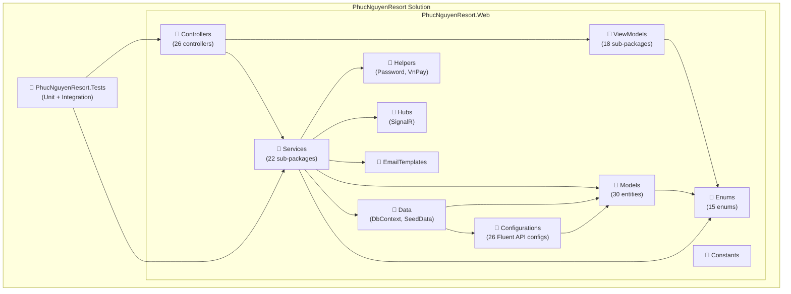
```mermaid
graph LR
    subgraph SOLUTION["PhucNguyenResort Solution"]
        direction LR

        subgraph WEB["PhucNguyenResort.Web"]
            direction TB
            CTRL["📂 Controllers\n(26 controllers)"]
            SVC["📂 Services\n(22 sub-packages)"]
            VM["📂 ViewModels\n(18 sub-packages)"]
            MODEL["📂 Models\n(30 entities)"]
            ENUM["📂 Enums\n(15 enums)"]
            DATA["📂 Data\n(DbContext, SeedData)"]
            CFG["📂 Configurations\n(26 Fluent API configs)"]
            HELPER["📂 Helpers\n(Password, VnPay)"]
            HUB["📂 Hubs\n(SignalR)"]
            TMPL["📂 EmailTemplates"]
            CONST["📂 Constants"]
        end

        TEST["📂 PhucNguyenResort.Tests\n(Unit + Integration)"]
    end

    %% Primary dependency flow (top-down)
    CTRL --> SVC
    CTRL --> VM
    SVC --> DATA
    SVC --> MODEL
    SVC --> HELPER
    SVC --> HUB
    SVC --> TMPL
    DATA --> MODEL
    DATA --> CFG
    CFG --> MODEL
    VM --> ENUM
    MODEL --> ENUM
    SVC --> ENUM
    TEST --> CTRL
    TEST --> SVC
```

### 1.2.2 Package Descriptions

| Package (Namespace)      | Location                                                                                                            | Description                                                                                                                                                                                                                |
| ------------------------ | ------------------------------------------------------------------------------------------------------------------- | -------------------------------------------------------------------------------------------------------------------------------------------------------------------------------------------------------------------------- |
| **Controllers**    | [Controllers/](file:///d:/SWP391_SU26/PRJ/su26-swp391-se2023-g1/PhucNguyenResort/PhucNguyenResort/Controllers)       | 26 MVC controllers. Each controller is the HTTP entry point for a functional area. Controllers validate input, invoke service methods, prepare ViewModels, and return Razor Views or redirects.                            |
| **Services**       | [Services/](file:///d:/SWP391_SU26/PRJ/su26-swp391-se2023-g1/PhucNguyenResort/PhucNguyenResort/Services)             | 22 sub-packages, each containing an`I*Service` interface and its implementation. Encapsulates all business logic, database queries, and external API calls. Includes 5 `BackgroundService` workers for scheduled jobs. |
| **Models**         | [Models/](file:///d:/SWP391_SU26/PRJ/su26-swp391-se2023-g1/PhucNguyenResort/PhucNguyenResort/Models)                 | 30 entity classes that map directly to database tables via EF Core. Contains data annotations for validation and navigation properties for relationships.                                                                  |
| **ViewModels**     | [ViewModels/](file:///d:/SWP391_SU26/PRJ/su26-swp391-se2023-g1/PhucNguyenResort/PhucNguyenResort/ViewModels)         | 18 sub-packages of DTOs (Data Transfer Objects) used to pass data between Controllers and Views. Provides form-binding, display formatting, and view-specific data aggregation.                                            |
| **Enums**          | [Enums/](file:///d:/SWP391_SU26/PRJ/su26-swp391-se2023-g1/PhucNguyenResort/PhucNguyenResort/Enums)                   | 15 enumeration types defining all status codes and type constants used throughout the system (BookingStatus, RoomStatus, FoodOrderStatus, KotStatus, etc.).                                                                |
| **Data**           | [Data/](file:///d:/SWP391_SU26/PRJ/su26-swp391-se2023-g1/PhucNguyenResort/PhucNguyenResort/Data)                     | Contains`ResortDbContext` (EF Core DbContext with 30 DbSets) and `SeedData` for initial data population.                                                                                                               |
| **Configurations** | [Configurations/](file:///d:/SWP391_SU26/PRJ/su26-swp391-se2023-g1/PhucNguyenResort/PhucNguyenResort/Configurations) | 26`IEntityTypeConfiguration<T>` classes defining Fluent API configurations (table names, relationships, constraints, indexes) for each entity.                                                                           |
| **Helpers**        | [Helpers/](file:///d:/SWP391_SU26/PRJ/su26-swp391-se2023-g1/PhucNguyenResort/PhucNguyenResort/Helpers)               | Utility classes:`PasswordHelper` (BCrypt hashing) and `VnPayLibrary` (HMAC-SHA512 signature generation/validation for VNPay).                                                                                          |
| **Constants**      | [Constants/](file:///d:/SWP391_SU26/PRJ/su26-swp391-se2023-g1/PhucNguyenResort/PhucNguyenResort/Constants)           | Static constant definitions:`AppRoles` (Customer, F&B Staff, Kitchen Staff role strings).                                                                                                                                |
| **Hubs**           | [Hubs/](file:///d:/SWP391_SU26/PRJ/su26-swp391-se2023-g1/PhucNguyenResort/PhucNguyenResort/Hubs)                     | SignalR hub:`NotificationHub` for real-time push notifications to connected clients.                                                                                                                                     |
| **EmailTemplates** | [EmailTemplates/](file:///d:/SWP391_SU26/PRJ/su26-swp391-se2023-g1/PhucNguyenResort/PhucNguyenResort/EmailTemplates) | HTML email templates for transactional emails: BookingSuccess, CheckInSuccess, CheckOutSuccess.                                                                                                                            |
| **Tests**          | [PhucNguyenResort.Tests/](file:///d:/SWP391_SU26/PRJ/su26-swp391-se2023-g1/PhucNguyenResort/PhucNguyenResort.Tests)  | xUnit test project containing unit tests and integration tests for controllers, services, and key business logic.                                                                                                          |

---

## 1.3 Database Design

### 1.3.1 Entity Relationship Diagram

### 1.3.2 Table Descriptions

#### User & Authentication Domain

| Table                  | Column                   | Type           | Constraint          | Description                                                                                                     |
| ---------------------- | ------------------------ | -------------- | ------------------- | --------------------------------------------------------------------------------------------------------------- |
| **Roles**        | RoleId                   | int            | PK, Identity        | Auto-increment primary key                                                                                      |
|                        | RoleName                 | nvarchar(50)   | Required, Unique    | Role name (Admin, Customer, Receptionist, F&B Staff, Kitchen Staff, Housekeeping, Business Manager, Tour Guide) |
| **Users**        | UserId                   | int            | PK, Identity        | Auto-increment primary key                                                                                      |
|                        | FullName                 | nvarchar(100)  | Required            | User's full name                                                                                                |
|                        | Email                    | nvarchar(100)  | Required, Unique    | Email address (used for login)                                                                                  |
|                        | PasswordHash             | nvarchar(255)  | Required            | BCrypt-hashed password                                                                                          |
|                        | PhoneNumber              | nvarchar(20)   | Nullable            | Contact phone number                                                                                            |
|                        | RoleId                   | int            | FK → Roles         | User's assigned role                                                                                            |
|                        | IsActive                 | bit            | Default: true       | Account activation status                                                                                       |
|                        | IsBlocked                | bit            | Default: false      | Admin-blocked flag                                                                                              |
|                        | CreatedAt                | datetime       | Default: Now        | Account creation timestamp                                                                                      |
|                        | ResetPasswordToken       | nvarchar(max)  | Nullable            | Password reset token                                                                                            |
|                        | ResetPasswordTokenExpiry | datetime       | Nullable            | Token expiry time                                                                                               |
| **UserProfiles** | ProfileId                | int            | PK, Identity        | Auto-increment primary key                                                                                      |
|                        | UserId                   | int            | FK → Users, Unique | One-to-one link to User                                                                                         |
|                        | DateOfBirth              | date           | Nullable            | Date of birth                                                                                                   |
|                        | Nationality              | nvarchar(50)   | Nullable            | Nationality                                                                                                     |
|                        | PassportNumber           | varbinary(max) | Nullable            | Encrypted CCCD/Passport number                                                                                  |
|                        | PassportImage            | nvarchar(255)  | Nullable            | Path to uploaded document image                                                                                 |
|                        | Address                  | nvarchar(255)  | Nullable            | Home address                                                                                                    |
|                        | ConsentGiven             | bit            | Default: false      | PDPD data processing consent                                                                                    |
|                        | DeletionRequested        | bit            | Default: false      | Data deletion request flag                                                                                      |
| **EmailOtps**    | OtpId                    | int            | PK, Identity        | Auto-increment primary key                                                                                      |
|                        | Email                    | nvarchar(100)  | Required            | Target email address                                                                                            |
|                        | OtpCode                  | nvarchar(6)    | Required            | 6-digit OTP code                                                                                                |
|                        | ExpiryTime               | datetime       | Required            | OTP expiry timestamp                                                                                            |
|                        | IsUsed                   | bit            | Default: false      | Whether OTP was consumed                                                                                        |
|                        | Attempts                 | int            | Default: 0          | Verification attempt counter                                                                                    |
|                        | CreatedAt                | datetime       | Default: Now        | OTP creation timestamp                                                                                          |

#### Room & Booking Domain

| Table                        | Column              | Type          | Constraint            | Description                                   |
| ---------------------------- | ------------------- | ------------- | --------------------- | --------------------------------------------- |
| **RoomCategories**     | CategoryId          | int           | PK, Identity          | Category ID                                   |
|                              | CategoryName        | nvarchar(100) | Nullable              | Category name (Deluxe, Suite, Standard, etc.) |
|                              | Description         | nvarchar(max) | Nullable              | Category description                          |
|                              | MaxAdults           | int           | Range(1,20)           | Maximum adults per room                       |
|                              | MaxChildren         | int           | Range(0,10)           | Maximum children per room                     |
|                              | PricePerNight       | decimal       | Range(0,999999999)    | Base price per night                          |
|                              | ImageUrl            | nvarchar(255) | Nullable              | Primary image URL                             |
| **RoomCategoryImages** | ImageId             | int           | PK, Identity          | Image ID                                      |
|                              | CategoryId          | int           | FK → RoomCategories  | Parent category                               |
|                              | ImageUrl            | nvarchar(255) | Nullable              | Image file path                               |
| **Rooms**              | RoomId              | int           | PK, Identity          | Room ID                                       |
|                              | RoomNumber          | nvarchar(20)  | Unique                | Physical room number (e.g., "301")            |
|                              | CategoryId          | int           | FK → RoomCategories  | Room category                                 |
|                              | FloorNumber         | int           | Range(0,200)          | Floor number                                  |
|                              | Status              | int (enum)    | Default: Available    | RoomStatus enum                               |
| **Bookings**           | BookingId           | int           | PK, Identity          | Booking ID                                    |
|                              | UserId              | int           | FK → Users           | Customer who booked                           |
|                              | CheckInDate         | date          | Required              | Planned check-in date                         |
|                              | CheckOutDate        | date          | Required              | Planned check-out date                        |
|                              | NumberOfAdults      | int           | Range(1,20)           | Guest count                                   |
|                              | NumberOfChildren    | int           | Range(0,10)           | Children count                                |
|                              | BookingStatus       | int (enum)    | Default: Reserved     | BookingStatus enum                            |
|                              | DepositAmount       | decimal       | Nullable              | Deposit paid amount                           |
|                              | TotalAmount         | decimal       | Nullable              | Total booking amount                          |
|                              | PdpdConsentChecked  | bit           | Required              | PDPD consent flag                             |
|                              | ExpectedArrivalTime | time          | Nullable              | Expected arrival time                         |
|                              | ActualCheckInTime   | datetime      | Nullable              | Actual check-in timestamp                     |
|                              | ActualCheckOutTime  | datetime      | Nullable              | Actual check-out timestamp                    |
|                              | CreatedAt           | datetime      | Default: Now          | Booking creation time                         |
| **BookingDetails**     | BookingDetailId     | int           | PK, Identity          | Detail ID                                     |
|                              | BookingId           | int           | FK → Bookings        | Parent booking                                |
|                              | RoomCategoryId      | int           | FK → RoomCategories  | Booked room category                          |
|                              | RoomId              | int?          | FK → Rooms, Nullable | Assigned physical room (set at check-in)      |
|                              | Price               | decimal       | Nullable              | Room price snapshot                           |
| **BookingGuests**      | BookingGuestId      | int           | PK, Identity          | Guest ID                                      |
|                              | BookingId           | int           | FK → Bookings        | Parent booking                                |
|                              | FullName            | nvarchar(100) | Nullable              | Guest full name                               |
|                              | DateOfBirth         | date          | Nullable              | Guest DOB                                     |
|                              | PassportNumber      | nvarchar(500) | Nullable              | CCCD/Passport number                          |
|                              | Nationality         | nvarchar(50)  | Nullable              | Guest nationality                             |
|                              | Gender              | int (enum)    | Nullable              | GenderType enum                               |
|                              | IsPrimaryBooker     | bit           | Required              | Primary booker flag                           |

#### Restaurant & F&B Domain

| Table                       | Column             | Type          | Constraint                        | Description                                        |
| --------------------------- | ------------------ | ------------- | --------------------------------- | -------------------------------------------------- |
| **MenuCategories**    | CategoryId         | int           | PK, Identity                      | Category ID                                        |
|                             | CategoryName       | nvarchar(100) | Required                          | Menu category name (Appetizers, Main Course, etc.) |
| **MenuItems**         | MenuItemId         | int           | PK, Identity                      | Menu item ID                                       |
|                             | CategoryId         | int           | FK → MenuCategories              | Parent category                                    |
|                             | ItemName           | nvarchar(100) | Required                          | Dish name                                          |
|                             | Description        | nvarchar(max) | Nullable                          | Dish description                                   |
|                             | Price              | decimal       | Required                          | Current price                                      |
|                             | ImageUrl           | nvarchar(255) | Nullable                          | Dish image                                         |
|                             | IsAvailable        | bit           | Default: true                     | Temporarily available for ordering                 |
|                             | IsDeleted          | bit           | Default: false                    | Soft-delete (discontinued)                         |
| **DiningTables**      | TableId            | int           | PK, Identity                      | Table ID                                           |
|                             | TableNumber        | nvarchar(20)  | Nullable                          | Table identifier                                   |
|                             | TableName          | nvarchar(100) | Required                          | Display name                                       |
|                             | Capacity           | int           | Range(1,50)                       | Seating capacity                                   |
|                             | Area               | nvarchar(50)  | Nullable                          | Restaurant area/zone                               |
|                             | Status             | int (enum)    | Default: Available                | DiningTableStatus enum                             |
|                             | IsReservable       | bit           | Default: true                     | Can be reserved by customers                       |
| **TableReservations** | ReservationId      | int           | PK, Identity                      | Reservation ID                                     |
|                             | ReservationCode    | nvarchar(max) | Required                          | Unique reservation code                            |
|                             | UserId             | int           | FK → Users                       | Customer who reserved                              |
|                             | TableId            | int           | FK → DiningTables                | Reserved table                                     |
|                             | BookingId          | int?          | FK → Bookings, Nullable          | Linked room booking (if any)                       |
|                             | ReservationDate    | date          | Required                          | Reservation date                                   |
|                             | ReservationTime    | time          | Required                          | Reservation time                                   |
|                             | DurationMinutes    | int           | Default: 120                      | Duration in minutes                                |
|                             | PartySize          | int           | Range(1,50)                       | Number of guests                                   |
|                             | Status             | int (enum)    | Default: Pending                  | TableReservationStatus enum                        |
| **FoodOrders**        | FoodOrderId        | int           | PK, Identity                      | Order ID                                           |
|                             | OrderType          | int (enum)    | Default: RoomService              | FoodOrderType (RoomService / TableService)         |
|                             | BookingId          | int?          | FK → Bookings, Nullable          | Linked room booking                                |
|                             | TableReservationId | int?          | FK → TableReservations, Nullable | Linked table reservation                           |
|                             | OrderStatus        | int (enum)    | Default: Pending                  | FoodOrderStatus enum                               |
|                             | TotalAmount        | decimal       | Nullable                          | Total order amount                                 |
|                             | OrderedAt          | datetime      | Default: Now                      | Order creation time                                |
|                             | IsChargedToRoom    | bit           | Default: false                    | Charged to guest folio flag                        |
|                             | ChargedAt          | datetime      | Nullable                          | Charge timestamp                                   |
|                             | IsPaidAtRestaurant | bit           | Default: false                    | Paid at restaurant flag                            |
| **FoodOrderItems**    | OrderItemId        | int           | PK, Identity                      | Line item ID                                       |
|                             | FoodOrderId        | int?          | FK → FoodOrders                  | Parent order                                       |
|                             | MenuItemId         | int?          | FK → MenuItems                   | Ordered menu item                                  |
|                             | Quantity           | int           | Range(1,1000)                     | Quantity ordered                                   |
|                             | UnitPrice          | decimal       | Required                          | Price snapshot at order time                       |
| **KOT**               | KotId              | int           | PK, Identity                      | Kitchen Order Ticket ID                            |
|                             | FoodOrderId        | int           | FK → FoodOrders, Unique          | One-to-one link to food order                      |
|                             | Status             | int (enum)    | Default: Pending                  | KotStatus enum                                     |
|                             | CreatedAt          | datetime      | Default: Now                      | KOT creation time                                  |

#### Tour Domain

| Table                   | Column           | Type          | Constraint               | Description                   |
| ----------------------- | ---------------- | ------------- | ------------------------ | ----------------------------- |
| **Tours**         | TourId           | int           | PK, Identity             | Tour ID                       |
|                         | TourName         | nvarchar(100) | Nullable                 | Tour package name             |
|                         | Description      | nvarchar(max) | Nullable                 | Tour description              |
|                         | Price            | decimal       | Nullable                 | Price per participant         |
|                         | MaxCapacity      | int           | Range(1,1000)            | Max participants per schedule |
|                         | DurationHours    | int           | Range(1,1000)            | Tour duration in hours        |
|                         | Location         | nvarchar(255) | Nullable                 | Tour location/destination     |
|                         | ImageUrl         | nvarchar(255) | Nullable                 | Tour cover image              |
| **TourImages**    | ImageId          | int           | PK, Identity             | Image ID                      |
|                         | TourId           | int           | FK → Tours              | Parent tour                   |
|                         | ImageUrl         | nvarchar(255) | Nullable                 | Gallery image path            |
| **TourSchedules** | ScheduleId       | int           | PK, Identity             | Schedule ID                   |
|                         | TourId           | int           | FK → Tours              | Parent tour package           |
|                         | TourDate         | date          | Required                 | Departure date                |
|                         | StartTime        | time          | Required                 | Departure time                |
|                         | AvailableSlots   | int           | Range(1,1000)            | Remaining available slots     |
|                         | GuideId          | int?          | FK → Users              | Assigned tour guide           |
| **TourBookings**  | TourBookingId    | int           | PK, Identity             | Tour booking ID               |
|                         | BookingId        | int?          | FK → Bookings, Nullable | Linked room booking           |
|                         | UserId           | int?          | FK → Users              | Customer                      |
|                         | ScheduleId       | int           | FK → TourSchedules      | Booked schedule               |
|                         | Participants     | int           | Range(1,1000)            | Number of participants        |
|                         | TotalAmount      | decimal       | Nullable                 | Total tour price              |
|                         | BookingStatus    | int (enum)    | Default: Pending         | TourBookingStatus enum        |
|                         | PrimaryGuestName | nvarchar(100) | Nullable                 | Main guest name               |
|                         | CreatedAt        | datetime      | Default: Now             | Booking timestamp             |

#### Billing & Payment Domain

| Table                       | Column           | Type          | Constraint                   | Description                                                                            |
| --------------------------- | ---------------- | ------------- | ---------------------------- | -------------------------------------------------------------------------------------- |
| **GuestFolios**       | FolioId          | int           | PK, Identity                 | Folio ID                                                                               |
|                             | BookingId        | int?          | FK → Bookings, Unique       | One-to-one link to booking                                                             |
|                             | TotalRoomCharges | decimal       | Default: 0                   | Accumulated room charges                                                               |
|                             | TotalFoodCharges | decimal       | Default: 0                   | Accumulated food charges                                                               |
|                             | TotalTourCharges | decimal       | Default: 0                   | Accumulated tour charges                                                               |
|                             | TotalAmount      | decimal       | Default: 0                   | Grand total                                                                            |
|                             | Status           | int (enum)    | Default: Unpaid              | FolioStatus enum                                                                       |
| **FolioTransactions** | TransactionId    | int           | PK, Identity                 | Transaction ID                                                                         |
|                             | FolioId          | int           | FK → GuestFolios            | Parent folio                                                                           |
|                             | TransactionType  | int (enum)    | Nullable                     | FolioTransactionType (RoomCharge, FoodCharge, TourCharge, Payment, Refund, Adjustment) |
|                             | ReferenceId      | int?          | Nullable                     | ID of related entity (BookingDetail, FoodOrder, TourBooking)                           |
|                             | Amount           | decimal       | Nullable                     | Transaction amount                                                                     |
|                             | CreatedAt        | datetime      | Default: Now                 | Transaction timestamp                                                                  |
| **Invoices**          | InvoiceId        | int           | PK, Identity                 | Invoice ID                                                                             |
|                             | FolioId          | int           | FK → GuestFolios, Unique    | One-to-one link to folio                                                               |
|                             | InvoiceNumber    | nvarchar(50)  | Nullable                     | Human-readable invoice number                                                          |
|                             | TotalAmount      | decimal       | Nullable                     | Subtotal                                                                               |
|                             | TaxAmount        | decimal       | Nullable                     | Tax amount                                                                             |
|                             | FinalAmount      | decimal       | Nullable                     | Total after tax                                                                        |
|                             | InvoiceStatus    | int (enum)    | Default: Draft               | InvoiceStatus enum                                                                     |
|                             | IssuedAt         | datetime      | Default: Now                 | Issue timestamp                                                                        |
| **Payments**          | PaymentId        | int           | PK, Identity                 | Payment ID                                                                             |
|                             | InvoiceId        | int?          | FK → Invoices, Nullable     | Linked invoice (room checkout)                                                         |
|                             | TourBookingId    | int?          | FK → TourBookings, Nullable | Linked tour booking                                                                    |
|                             | PaymentMethod    | int (enum)    | Nullable                     | PaymentMethod enum                                                                     |
|                             | Amount           | decimal       | Nullable                     | Payment amount                                                                         |
|                             | PaymentStatus    | int (enum)    | Nullable                     | PaymentStatus enum                                                                     |
|                             | TransactionCode  | nvarchar(100) | Nullable                     | VNPay transaction code                                                                 |
|                             | PaidAt           | datetime      | Nullable                     | Payment timestamp                                                                      |
| **Refunds**           | RefundId         | int           | PK, Identity                 | Refund ID                                                                              |
|                             | BookingId        | int?          | FK → Bookings               | Cancelled booking                                                                      |
|                             | RefundAmount     | decimal       | Nullable                     | Refund amount (after cancellation policy)                                              |
|                             | RefundReason     | nvarchar(max) | Nullable                     | Reason for refund                                                                      |
|                             | BankDetails      | nvarchar(200) | Nullable                     | Customer bank account for refund                                                       |
|                             | RefundStatus     | int (enum)    | Nullable                     | RefundStatus enum                                                                      |
|                             | CreatedAt        | datetime      | Default: Now                 | Refund request timestamp                                                               |

#### Supporting Domain

| Table                         | Column         | Type          | Constraint               | Description                              |
| ----------------------------- | -------------- | ------------- | ------------------------ | ---------------------------------------- |
| **Reviews**             | ReviewId       | int           | PK, Identity             | Review ID                                |
|                               | UserId         | int?          | FK → Users              | Review author                            |
|                               | TourId         | int?          | FK → Tours, Nullable    | Reviewed tour                            |
|                               | BookingId      | int?          | FK → Bookings, Nullable | Reviewed booking                         |
|                               | TourBookingId  | int?          | Nullable                 | Reviewed tour booking                    |
|                               | Rating         | int           | Range(1,5)               | Star rating                              |
|                               | Comment        | nvarchar(max) | Nullable                 | Written review                           |
|                               | IsVisible      | bit           | Default: true            | Visible on public site (moderation flag) |
|                               | CreatedAt      | datetime      | Default: Now             | Review timestamp                         |
| **Notifications**       | NotificationId | int           | PK, Identity             | Notification ID                          |
|                               | UserId         | int?          | FK → Users              | Target user                              |
|                               | Title          | nvarchar(255) | Nullable                 | Notification title                       |
|                               | Message        | nvarchar(max) | Nullable                 | Notification body                        |
|                               | IsRead         | bit           | Default: false           | Read status                              |
|                               | SentAt         | datetime      | Default: Now             | Send timestamp                           |
| **MaintenanceRequests** | RequestId      | int           | PK, Identity             | Request ID                               |
|                               | RoomId         | int           | FK → Rooms              | Affected room                            |
|                               | Description    | nvarchar(500) | Required                 | Issue description                        |
|                               | CreatedAt      | datetime      | Default: Now             | Request timestamp                        |
|                               | IsResolved     | bit           | Default: false           | Resolution status                        |
|                               | ResolvedAt     | datetime      | Nullable                 | Resolution timestamp                     |

---

# 2. Detailed Design

## 2.1 State Transition Diagrams

### 2.1.1 Booking Status

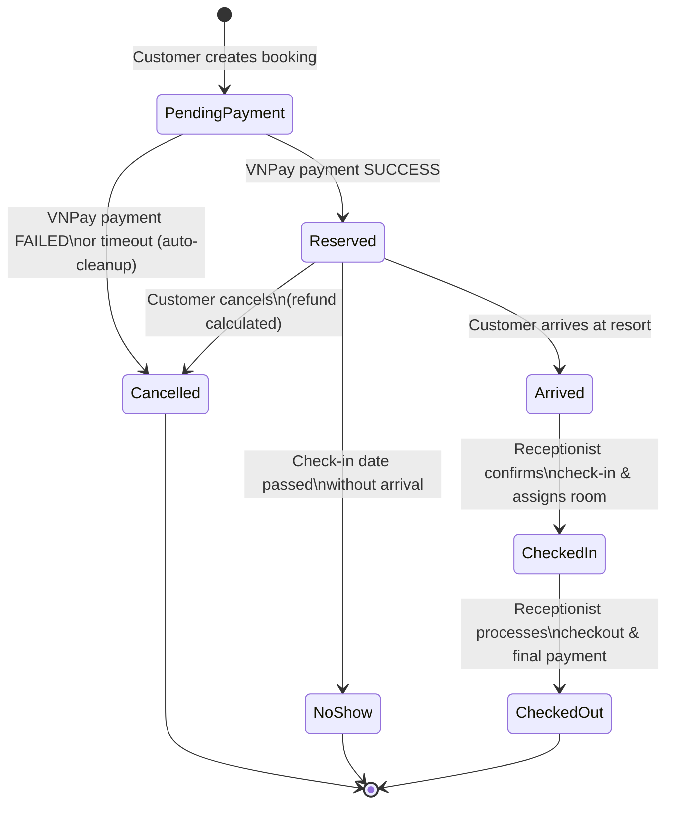
```mermaid
stateDiagram-v2
    [*] --> PendingPayment: Customer creates booking

    PendingPayment --> Reserved: VNPay payment SUCCESS
    PendingPayment --> Cancelled: VNPay payment FAILED\nor timeout (auto-cleanup)

    Reserved --> Arrived: Customer arrives at resort
    Reserved --> Cancelled: Customer cancels\n(refund calculated)
    Reserved --> NoShow: Check-in date passed\nwithout arrival

    Arrived --> CheckedIn: Receptionist confirms\ncheck-in & assigns room

    CheckedIn --> CheckedOut: Receptionist processes\ncheckout & final payment

    Cancelled --> [*]
    NoShow --> [*]
    CheckedOut --> [*]
```

**States Description:**

| State              | Description                                                 |
| ------------------ | ----------------------------------------------------------- |
| `PendingPayment` | Booking created, awaiting deposit payment via VNPay         |
| `Reserved`       | Deposit paid, booking confirmed                             |
| `Arrived`        | Customer has arrived at resort but not yet checked in       |
| `CheckedIn`      | Customer checked in, room assigned, folio opened            |
| `CheckedOut`     | Stay completed, all charges settled, folio closed           |
| `Cancelled`      | Booking cancelled (by customer or system), refund processed |
| `NoShow`         | Customer did not arrive by check-in date                    |

---

### 2.1.2 Room Status

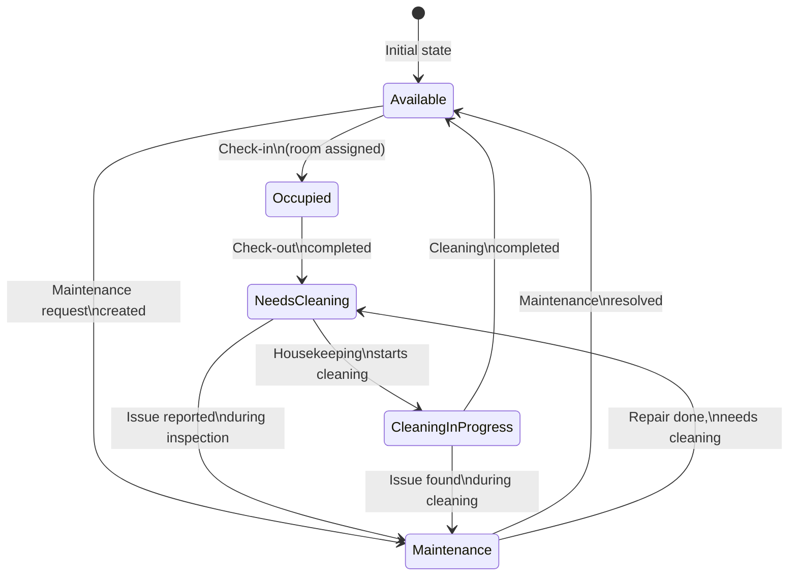
```mermaid
stateDiagram-v2
    [*] --> Available: Initial state

    Available --> Occupied: Check-in\n(room assigned)
    Available --> Maintenance: Maintenance request\ncreated

    Occupied --> NeedsCleaning: Check-out\ncompleted

    NeedsCleaning --> CleaningInProgress: Housekeeping\nstarts cleaning
    NeedsCleaning --> Maintenance: Issue reported\nduring inspection

    CleaningInProgress --> Available: Cleaning\ncompleted
    CleaningInProgress --> Maintenance: Issue found\nduring cleaning

    Maintenance --> Available: Maintenance\nresolved
    Maintenance --> NeedsCleaning: Repair done,\nneeds cleaning
```

---

### 2.1.3 Food Order Status

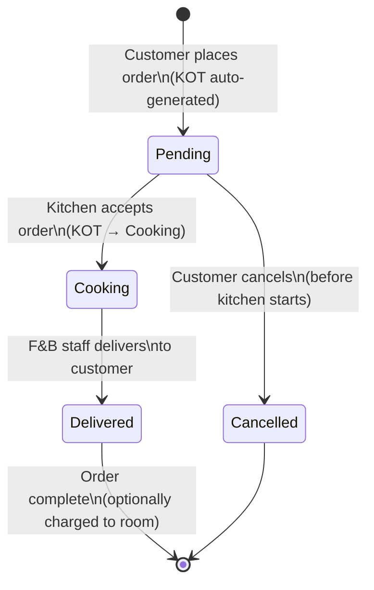
```mermaid
stateDiagram-v2
    [*] --> Pending: Customer places order\n(KOT auto-generated)

    Pending --> Cooking: Kitchen accepts order\n(KOT → Cooking)
    Pending --> Cancelled: Customer cancels\n(before kitchen starts)

    Cooking --> Delivered: F&B staff delivers\nto customer

    Delivered --> [*]: Order complete\n(optionally charged to room)

    Cancelled --> [*]
```

---

### 2.1.4 Kitchen Order Ticket (KOT) Status

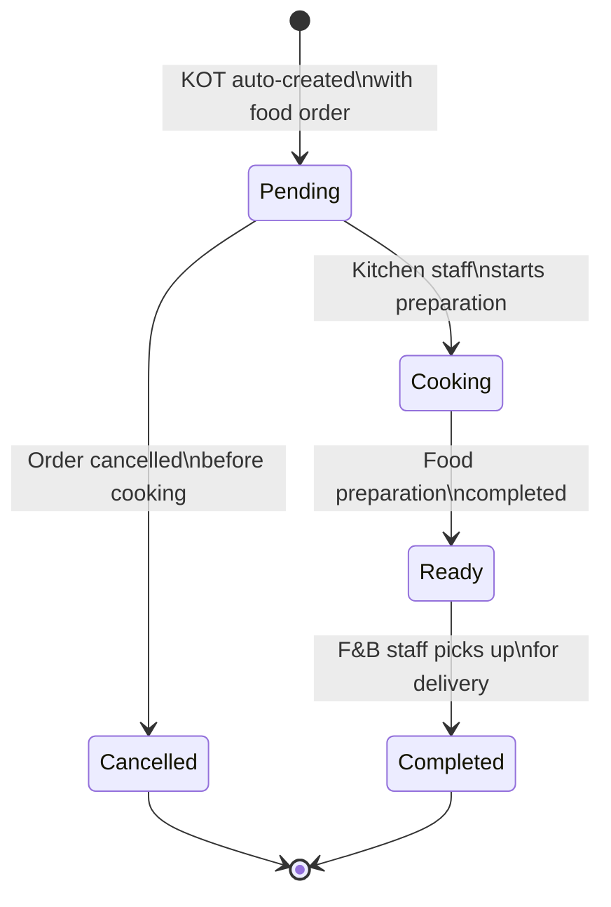
```mermaid
stateDiagram-v2
    [*] --> Pending: KOT auto-created\nwith food order

    Pending --> Cooking: Kitchen staff\nstarts preparation

    Cooking --> Ready: Food preparation\ncompleted

    Ready --> Completed: F&B staff picks up\nfor delivery

    Pending --> Cancelled: Order cancelled\nbefore cooking

    Cancelled --> [*]
    Completed --> [*]
```

---

### 2.1.5 Tour Booking Status

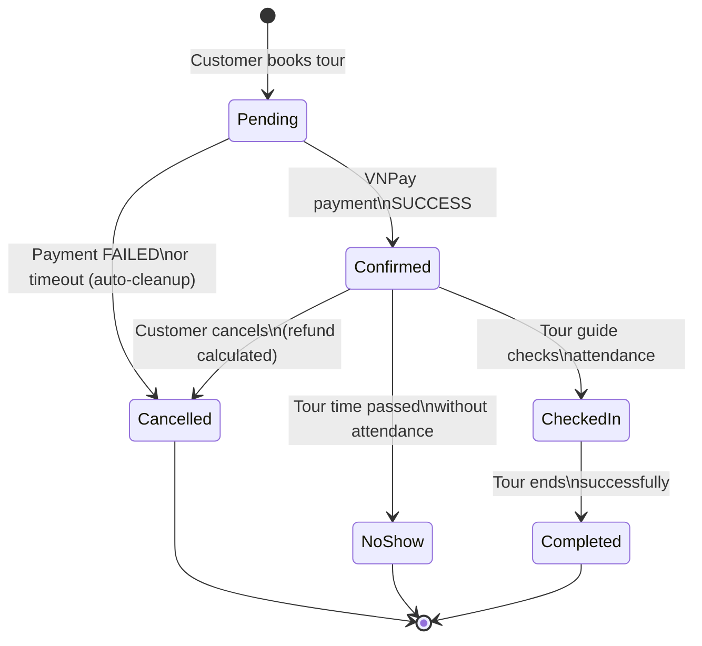
```mermaid
stateDiagram-v2
    [*] --> Pending: Customer books tour

    Pending --> Confirmed: VNPay payment\nSUCCESS
    Pending --> Cancelled: Payment FAILED\nor timeout (auto-cleanup)

    Confirmed --> CheckedIn: Tour guide checks\nattendance
    Confirmed --> Cancelled: Customer cancels\n(refund calculated)
    Confirmed --> NoShow: Tour time passed\nwithout attendance

    CheckedIn --> Completed: Tour ends\nsuccessfully

    Cancelled --> [*]
    NoShow --> [*]
    Completed --> [*]
```

---

### 2.1.6 Table Reservation Status

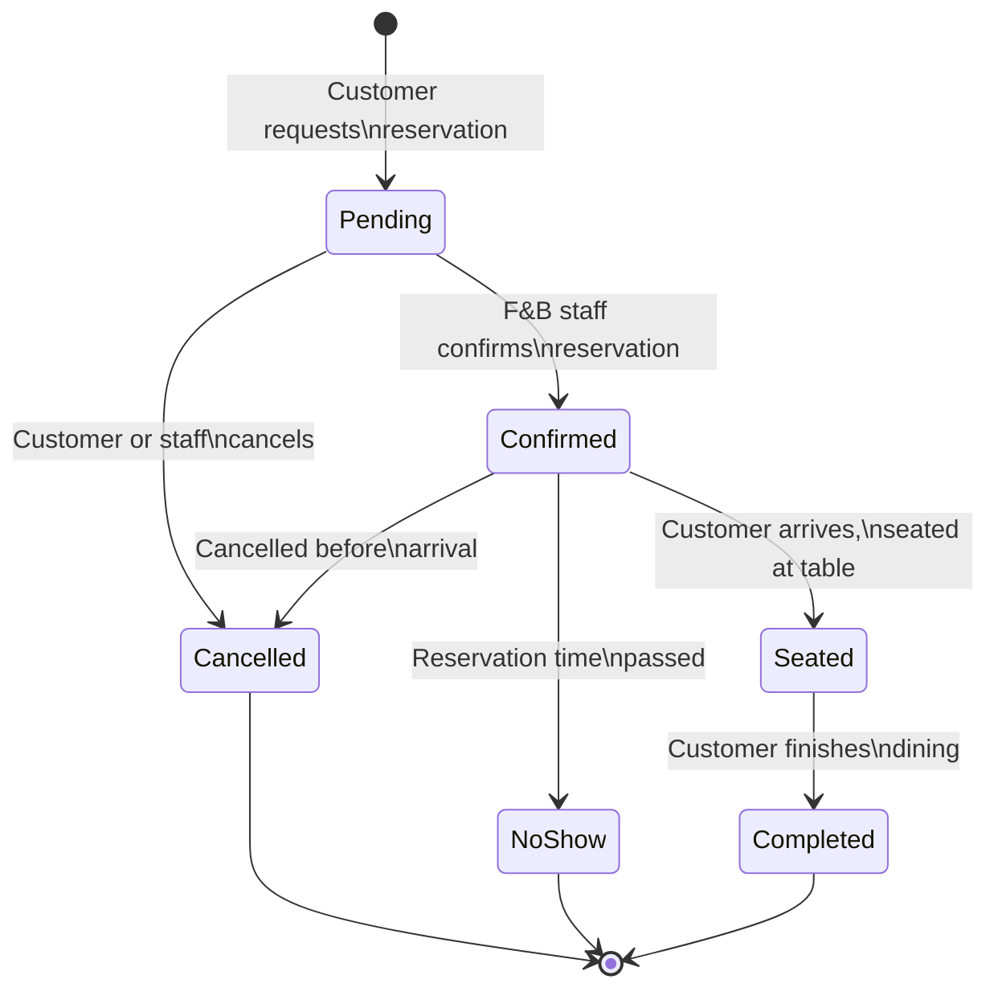
```mermaid
stateDiagram-v2
    [*] --> Pending: Customer requests\nreservation

    Pending --> Confirmed: F&B staff confirms\nreservation
    Pending --> Cancelled: Customer or staff\ncancels

    Confirmed --> Seated: Customer arrives,\nseated at table
    Confirmed --> Cancelled: Cancelled before\narrival
    Confirmed --> NoShow: Reservation time\npassed

    Seated --> Completed: Customer finishes\ndining

    Cancelled --> [*]
    NoShow --> [*]
    Completed --> [*]
```

---

### 2.1.7 Guest Folio & Invoice Status

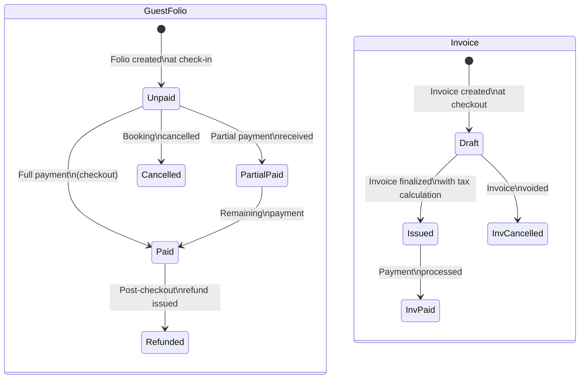
```mermaid
stateDiagram-v2
    state GuestFolio {
        [*] --> Unpaid: Folio created\nat check-in

        Unpaid --> PartialPaid: Partial payment\nreceived
        Unpaid --> Paid: Full payment\n(checkout)

        PartialPaid --> Paid: Remaining\npayment

        Paid --> Refunded: Post-checkout\nrefund issued

        Unpaid --> Cancelled: Booking\ncancelled
    }

    state Invoice {
        [*] --> Draft: Invoice created\nat checkout

        Draft --> Issued: Invoice finalized\nwith tax calculation

        Issued --> InvPaid: Payment\nprocessed

        Draft --> InvCancelled: Invoice\nvoided
    }
```

---

### 2.1.8 Payment & Refund Status

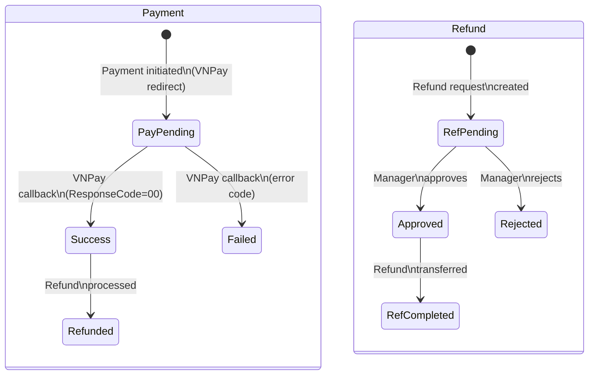
```mermaid
stateDiagram-v2
    state Payment {
        [*] --> PayPending: Payment initiated\n(VNPay redirect)

        PayPending --> Success: VNPay callback\n(ResponseCode=00)

        PayPending --> Failed: VNPay callback\n(error code)

        Success --> Refunded: Refund\nprocessed
    }

    state Refund {
        [*] --> RefPending: Refund request\ncreated

        RefPending --> Approved: Manager\napproves

        RefPending --> Rejected: Manager\nrejects

        Approved --> RefCompleted: Refund\ntransferred
    }
```

---

## 2.2 Class Diagrams

### 2.2.1 Domain Model – Core Entities

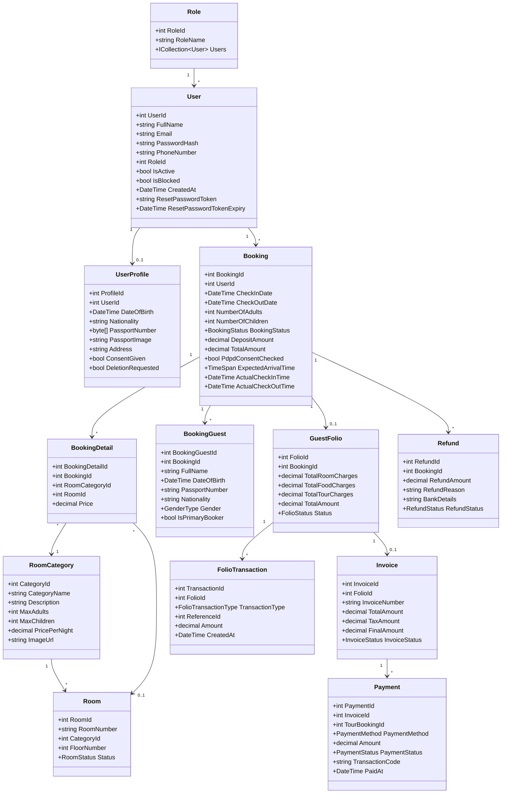
```mermaid
classDiagram
    class Role {
        +int RoleId
        +string RoleName
        +ICollection~User~ Users
    }

    class User {
        +int UserId
        +string FullName
        +string Email
        +string PasswordHash
        +string PhoneNumber
        +int RoleId
        +bool IsActive
        +bool IsBlocked
        +DateTime CreatedAt
        +string ResetPasswordToken
        +DateTime ResetPasswordTokenExpiry
    }

    class UserProfile {
        +int ProfileId
        +int UserId
        +DateTime DateOfBirth
        +string Nationality
        +byte[] PassportNumber
        +string PassportImage
        +string Address
        +bool ConsentGiven
        +bool DeletionRequested
    }

    class Booking {
        +int BookingId
        +int UserId
        +DateTime CheckInDate
        +DateTime CheckOutDate
        +int NumberOfAdults
        +int NumberOfChildren
        +BookingStatus BookingStatus
        +decimal DepositAmount
        +decimal TotalAmount
        +bool PdpdConsentChecked
        +TimeSpan ExpectedArrivalTime
        +DateTime ActualCheckInTime
        +DateTime ActualCheckOutTime
    }

    class BookingDetail {
        +int BookingDetailId
        +int BookingId
        +int RoomCategoryId
        +int RoomId
        +decimal Price
    }

    class BookingGuest {
        +int BookingGuestId
        +int BookingId
        +string FullName
        +DateTime DateOfBirth
        +string PassportNumber
        +string Nationality
        +GenderType Gender
        +bool IsPrimaryBooker
    }

    class RoomCategory {
        +int CategoryId
        +string CategoryName
        +string Description
        +int MaxAdults
        +int MaxChildren
        +decimal PricePerNight
        +string ImageUrl
    }

    class Room {
        +int RoomId
        +string RoomNumber
        +int CategoryId
        +int FloorNumber
        +RoomStatus Status
    }

    class GuestFolio {
        +int FolioId
        +int BookingId
        +decimal TotalRoomCharges
        +decimal TotalFoodCharges
        +decimal TotalTourCharges
        +decimal TotalAmount
        +FolioStatus Status
    }

    class FolioTransaction {
        +int TransactionId
        +int FolioId
        +FolioTransactionType TransactionType
        +int ReferenceId
        +decimal Amount
        +DateTime CreatedAt
    }

    class Invoice {
        +int InvoiceId
        +int FolioId
        +string InvoiceNumber
        +decimal TotalAmount
        +decimal TaxAmount
        +decimal FinalAmount
        +InvoiceStatus InvoiceStatus
    }

    class Payment {
        +int PaymentId
        +int InvoiceId
        +int TourBookingId
        +PaymentMethod PaymentMethod
        +decimal Amount
        +PaymentStatus PaymentStatus
        +string TransactionCode
        +DateTime PaidAt
    }

    class Refund {
        +int RefundId
        +int BookingId
        +decimal RefundAmount
        +string RefundReason
        +string BankDetails
        +RefundStatus RefundStatus
    }

    Role "1" --> "*" User
    User "1" --> "0..1" UserProfile
    User "1" --> "*" Booking
    Booking "1" --> "*" BookingDetail
    Booking "1" --> "*" BookingGuest
    Booking "1" --> "0..1" GuestFolio
    Booking "1" --> "*" Refund
    BookingDetail "*" --> "1" RoomCategory
    BookingDetail "*" --> "0..1" Room
    RoomCategory "1" --> "*" Room
    GuestFolio "1" --> "*" FolioTransaction
    GuestFolio "1" --> "0..1" Invoice
    Invoice "1" --> "*" Payment
```

### 2.2.2 Domain Model – Restaurant & Tour

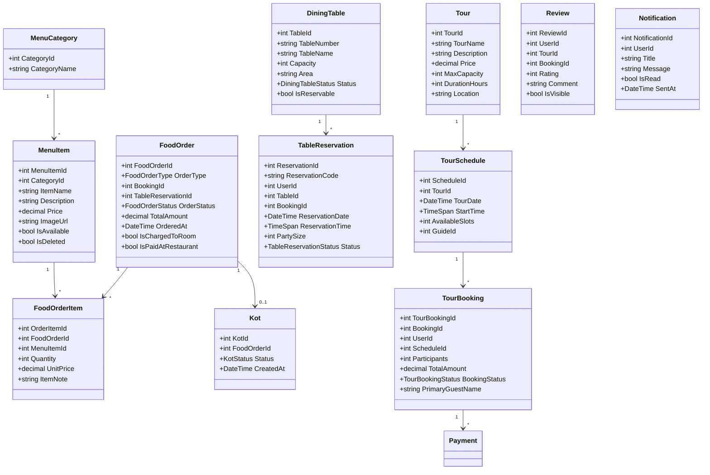
```mermaid
classDiagram
    class MenuCategory {
        +int CategoryId
        +string CategoryName
    }

    class MenuItem {
        +int MenuItemId
        +int CategoryId
        +string ItemName
        +string Description
        +decimal Price
        +string ImageUrl
        +bool IsAvailable
        +bool IsDeleted
    }

    class FoodOrder {
        +int FoodOrderId
        +FoodOrderType OrderType
        +int BookingId
        +int TableReservationId
        +FoodOrderStatus OrderStatus
        +decimal TotalAmount
        +DateTime OrderedAt
        +bool IsChargedToRoom
        +bool IsPaidAtRestaurant
    }

    class FoodOrderItem {
        +int OrderItemId
        +int FoodOrderId
        +int MenuItemId
        +int Quantity
        +decimal UnitPrice
        +string ItemNote
    }

    class Kot {
        +int KotId
        +int FoodOrderId
        +KotStatus Status
        +DateTime CreatedAt
    }

    class DiningTable {
        +int TableId
        +string TableNumber
        +string TableName
        +int Capacity
        +string Area
        +DiningTableStatus Status
        +bool IsReservable
    }

    class TableReservation {
        +int ReservationId
        +string ReservationCode
        +int UserId
        +int TableId
        +int BookingId
        +DateTime ReservationDate
        +TimeSpan ReservationTime
        +int PartySize
        +TableReservationStatus Status
    }

    class Tour {
        +int TourId
        +string TourName
        +string Description
        +decimal Price
        +int MaxCapacity
        +int DurationHours
        +string Location
    }

    class TourSchedule {
        +int ScheduleId
        +int TourId
        +DateTime TourDate
        +TimeSpan StartTime
        +int AvailableSlots
        +int GuideId
    }

    class TourBooking {
        +int TourBookingId
        +int BookingId
        +int UserId
        +int ScheduleId
        +int Participants
        +decimal TotalAmount
        +TourBookingStatus BookingStatus
        +string PrimaryGuestName
    }

    class Review {
        +int ReviewId
        +int UserId
        +int TourId
        +int BookingId
        +int Rating
        +string Comment
        +bool IsVisible
    }

    class Notification {
        +int NotificationId
        +int UserId
        +string Title
        +string Message
        +bool IsRead
        +DateTime SentAt
    }

    MenuCategory "1" --> "*" MenuItem
    MenuItem "1" --> "*" FoodOrderItem
    FoodOrder "1" --> "*" FoodOrderItem
    FoodOrder "1" --> "0..1" Kot
    DiningTable "1" --> "*" TableReservation
    Tour "1" --> "*" TourSchedule
    TourSchedule "1" --> "*" TourBooking
    TourBooking "1" --> "*" Payment
```

### 2.2.3 Controller – Service – Data Layer

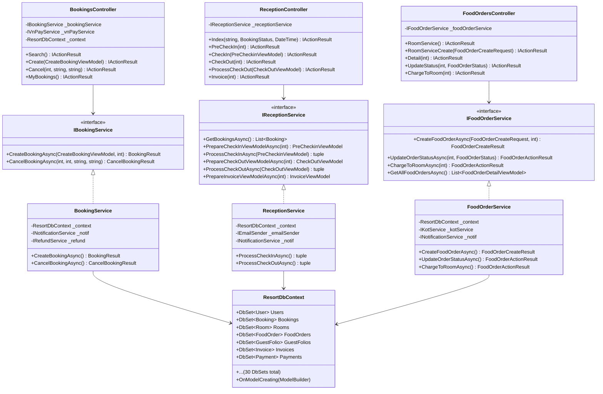
```mermaid
classDiagram
    class BookingsController {
        -IBookingService _bookingService
        -IVnPayService _vnPayService
        -ResortDbContext _context
        +Search() IActionResult
        +Create(CreateBookingViewModel) IActionResult
        +Cancel(int, string, string) IActionResult
        +MyBookings() IActionResult
    }

    class IBookingService {
        <<interface>>
        +CreateBookingAsync(CreateBookingViewModel, int) BookingResult
        +CancelBookingAsync(int, int, string, string) CancelBookingResult
    }

    class BookingService {
        -ResortDbContext _context
        -INotificationService _notif
        -IRefundService _refund
        +CreateBookingAsync() BookingResult
        +CancelBookingAsync() CancelBookingResult
    }

    class ReceptionController {
        -IReceptionService _receptionService
        +Index(string, BookingStatus, DateTime) IActionResult
        +PreCheckIn(int) IActionResult
        +CheckIn(PreCheckinViewModel) IActionResult
        +CheckOut(int) IActionResult
        +ProcessCheckOut(CheckOutViewModel) IActionResult
        +Invoice(int) IActionResult
    }

    class IReceptionService {
        <<interface>>
        +GetBookingsAsync() List~Booking~
        +PrepareCheckInViewModelAsync(int) PreCheckinViewModel
        +ProcessCheckInAsync(PreCheckinViewModel) tuple
        +PrepareCheckOutViewModelAsync(int) CheckOutViewModel
        +ProcessCheckOutAsync(CheckOutViewModel) tuple
        +PrepareInvoiceViewModelAsync(int) InvoiceViewModel
    }

    class ReceptionService {
        -ResortDbContext _context
        -IEmailSender _emailSender
        -INotificationService _notif
        +ProcessCheckInAsync() tuple
        +ProcessCheckOutAsync() tuple
    }

    class FoodOrdersController {
        -IFoodOrderService _foodOrderService
        +RoomService() IActionResult
        +RoomServiceCreate(FoodOrderCreateRequest) IActionResult
        +Detail(int) IActionResult
        +UpdateStatus(int, FoodOrderStatus) IActionResult
        +ChargeToRoom(int) IActionResult
    }

    class IFoodOrderService {
        <<interface>>
        +CreateFoodOrderAsync(FoodOrderCreateRequest, int) FoodOrderCreateResult
        +UpdateOrderStatusAsync(int, FoodOrderStatus) FoodOrderActionResult
        +ChargeToRoomAsync(int) FoodOrderActionResult
        +GetAllFoodOrdersAsync() List~FoodOrderDetailViewModel~
    }

    class FoodOrderService {
        -ResortDbContext _context
        -IKotService _kotService
        -INotificationService _notif
        +CreateFoodOrderAsync() FoodOrderCreateResult
        +UpdateOrderStatusAsync() FoodOrderActionResult
        +ChargeToRoomAsync() FoodOrderActionResult
    }

    class ResortDbContext {
        +DbSet~User~ Users
        +DbSet~Booking~ Bookings
        +DbSet~Room~ Rooms
        +DbSet~FoodOrder~ FoodOrders
        +DbSet~GuestFolio~ GuestFolios
        +DbSet~Invoice~ Invoices
        +DbSet~Payment~ Payments
        +... (30 DbSets total)
        +OnModelCreating(ModelBuilder)
    }

    BookingsController --> IBookingService
    IBookingService <|.. BookingService
    BookingService --> ResortDbContext

    ReceptionController --> IReceptionService
    IReceptionService <|.. ReceptionService
    ReceptionService --> ResortDbContext

    FoodOrdersController --> IFoodOrderService
    IFoodOrderService <|.. FoodOrderService
    FoodOrderService --> ResortDbContext
```

### 2.2.4 Cross-Cutting Services

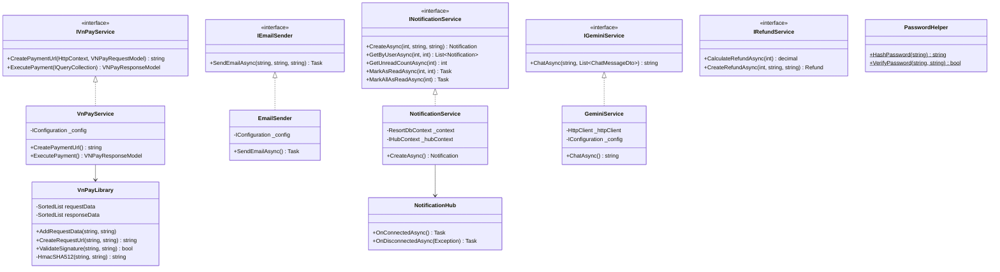
```mermaid
classDiagram
    class IVnPayService {
        <<interface>>
        +CreatePaymentUrl(HttpContext, VNPayRequestModel) string
        +ExecutePayment(IQueryCollection) VNPayResponseModel
    }

    class VnPayService {
        -IConfiguration _config
        +CreatePaymentUrl() string
        +ExecutePayment() VNPayResponseModel
    }

    class VnPayLibrary {
        -SortedList requestData
        -SortedList responseData
        +AddRequestData(string, string)
        +CreateRequestUrl(string, string) string
        +ValidateSignature(string, string) bool
        -HmacSHA512(string, string) string
    }

    class IEmailSender {
        <<interface>>
        +SendEmailAsync(string, string, string) Task
    }

    class EmailSender {
        -IConfiguration _config
        +SendEmailAsync() Task
    }

    class INotificationService {
        <<interface>>
        +CreateAsync(int, string, string) Notification
        +GetByUserAsync(int, int) List~Notification~
        +GetUnreadCountAsync(int) int
        +MarkAsReadAsync(int, int) Task
        +MarkAllAsReadAsync(int) Task
    }

    class NotificationService {
        -ResortDbContext _context
        -IHubContext _hubContext
        +CreateAsync() Notification
    }

    class NotificationHub {
        +OnConnectedAsync() Task
        +OnDisconnectedAsync(Exception) Task
    }

    class IGeminiService {
        <<interface>>
        +ChatAsync(string, List~ChatMessageDto~) string
    }

    class GeminiService {
        -HttpClient _httpClient
        -IConfiguration _config
        +ChatAsync() string
    }

    class IRefundService {
        <<interface>>
        +CalculateRefundAsync(int) decimal
        +CreateRefundAsync(int, string, string) Refund
    }

    class PasswordHelper {
        +HashPassword(string) string$
        +VerifyPassword(string, string) bool$
    }

    IVnPayService <|.. VnPayService
    VnPayService --> VnPayLibrary
    IEmailSender <|.. EmailSender
    INotificationService <|.. NotificationService
    NotificationService --> NotificationHub
    IGeminiService <|.. GeminiService
```

---

## 2.3 Sequence Diagrams

### 2.3.1 UC22 – Room Booking & Deposit Payment

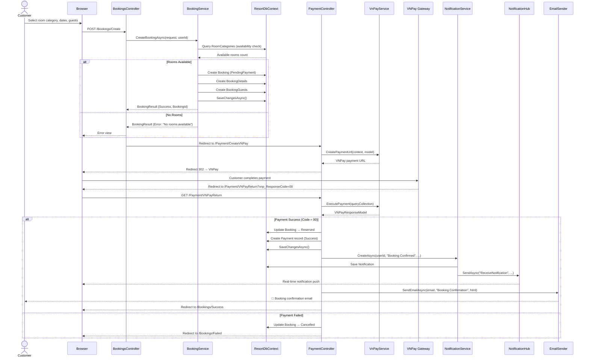
```mermaid
sequenceDiagram
    actor Customer
    participant Browser
    participant BookingsCtrl as BookingsController
    participant BookingSvc as BookingService
    participant DB as ResortDbContext
    participant PaymentCtrl as PaymentController
    participant VnPaySvc as VnPayService
    participant VNPay as VNPay Gateway
    participant NotifSvc as NotificationService
    participant Hub as NotificationHub
    participant EmailSvc as EmailSender

    Customer->>Browser: Select room category, dates, guests
    Browser->>BookingsCtrl: POST /Bookings/Create
    BookingsCtrl->>BookingSvc: CreateBookingAsync(request, userId)

    BookingSvc->>DB: Query RoomCategories (availability check)
    DB-->>BookingSvc: Available rooms count

    alt Rooms Available
        BookingSvc->>DB: Create Booking (PendingPayment)
        BookingSvc->>DB: Create BookingDetails
        BookingSvc->>DB: Create BookingGuests
        BookingSvc->>DB: SaveChangesAsync()
        BookingSvc-->>BookingsCtrl: BookingResult {Success, BookingId}
    else No Rooms
        BookingSvc-->>BookingsCtrl: BookingResult {Error: "No rooms available"}
        BookingsCtrl-->>Browser: Error view
    end

    BookingsCtrl->>PaymentCtrl: Redirect to /Payment/CreateVNPay
    PaymentCtrl->>VnPaySvc: CreatePaymentUrl(context, model)
    VnPaySvc-->>PaymentCtrl: VNPay payment URL
    PaymentCtrl-->>Browser: Redirect 302 → VNPay

    Browser->>VNPay: Customer completes payment
    VNPay-->>Browser: Redirect to /Payment/VNPayReturn?vnp_ResponseCode=00

    Browser->>PaymentCtrl: GET /Payment/VNPayReturn
    PaymentCtrl->>VnPaySvc: ExecutePayment(queryCollection)
    VnPaySvc-->>PaymentCtrl: VNPayResponseModel

    alt Payment Success (Code = 00)
        PaymentCtrl->>DB: Update Booking → Reserved
        PaymentCtrl->>DB: Create Payment record (Success)
        PaymentCtrl->>DB: SaveChangesAsync()
        PaymentCtrl->>NotifSvc: CreateAsync(userId, "Booking Confirmed", ...)
        NotifSvc->>DB: Save Notification
        NotifSvc->>Hub: SendAsync("ReceiveNotification", ...)
        Hub-->>Browser: Real-time notification push
        PaymentCtrl->>EmailSvc: SendEmailAsync(email, "Booking Confirmation", html)
        EmailSvc-->>Customer: 📧 Booking confirmation email
        PaymentCtrl-->>Browser: Redirect to /Bookings/Success
    else Payment Failed
        PaymentCtrl->>DB: Update Booking → Cancelled
        PaymentCtrl-->>Browser: Redirect to /Bookings/Failed
    end
```

---

### 2.3.2 UC51/UC53 – Check-in & Check-out

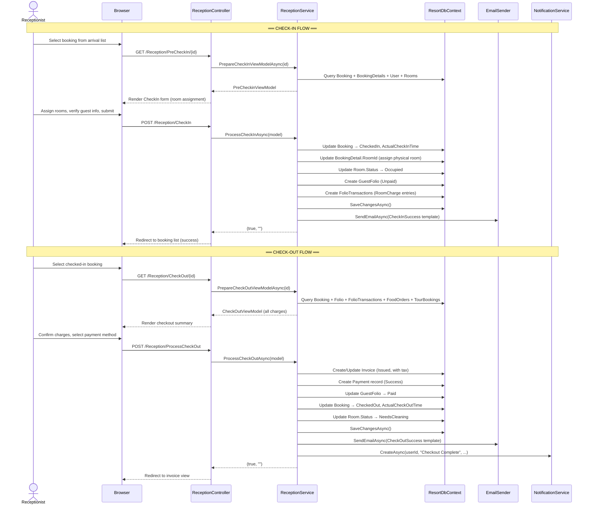
```mermaid
sequenceDiagram
    actor Receptionist
    participant Browser
    participant ReceptionCtrl as ReceptionController
    participant ReceptionSvc as ReceptionService
    participant DB as ResortDbContext
    participant EmailSvc as EmailSender
    participant NotifSvc as NotificationService

    Note over Receptionist,NotifSvc: ══ CHECK-IN FLOW ══

    Receptionist->>Browser: Select booking from arrival list
    Browser->>ReceptionCtrl: GET /Reception/PreCheckIn/{id}
    ReceptionCtrl->>ReceptionSvc: PrepareCheckInViewModelAsync(id)
    ReceptionSvc->>DB: Query Booking + BookingDetails + User + Rooms
    ReceptionSvc-->>ReceptionCtrl: PreCheckinViewModel
    ReceptionCtrl-->>Browser: Render CheckIn form (room assignment)

    Receptionist->>Browser: Assign rooms, verify guest info, submit
    Browser->>ReceptionCtrl: POST /Reception/CheckIn
    ReceptionCtrl->>ReceptionSvc: ProcessCheckInAsync(model)

    ReceptionSvc->>DB: Update Booking → CheckedIn, ActualCheckInTime
    ReceptionSvc->>DB: Update BookingDetail.RoomId (assign physical room)
    ReceptionSvc->>DB: Update Room.Status → Occupied
    ReceptionSvc->>DB: Create GuestFolio (Unpaid)
    ReceptionSvc->>DB: Create FolioTransactions (RoomCharge entries)
    ReceptionSvc->>DB: SaveChangesAsync()
    ReceptionSvc->>EmailSvc: SendEmailAsync(CheckInSuccess template)
    ReceptionSvc-->>ReceptionCtrl: (true, "")
    ReceptionCtrl-->>Browser: Redirect to booking list (success)

    Note over Receptionist,NotifSvc: ══ CHECK-OUT FLOW ══

    Receptionist->>Browser: Select checked-in booking
    Browser->>ReceptionCtrl: GET /Reception/CheckOut/{id}
    ReceptionCtrl->>ReceptionSvc: PrepareCheckOutViewModelAsync(id)
    ReceptionSvc->>DB: Query Booking + Folio + FolioTransactions + FoodOrders + TourBookings
    ReceptionSvc-->>ReceptionCtrl: CheckOutViewModel (all charges)
    ReceptionCtrl-->>Browser: Render checkout summary

    Receptionist->>Browser: Confirm charges, select payment method
    Browser->>ReceptionCtrl: POST /Reception/ProcessCheckOut
    ReceptionCtrl->>ReceptionSvc: ProcessCheckOutAsync(model)

    ReceptionSvc->>DB: Create/Update Invoice (Issued, with tax)
    ReceptionSvc->>DB: Create Payment record (Success)
    ReceptionSvc->>DB: Update GuestFolio → Paid
    ReceptionSvc->>DB: Update Booking → CheckedOut, ActualCheckOutTime
    ReceptionSvc->>DB: Update Room.Status → NeedsCleaning
    ReceptionSvc->>DB: SaveChangesAsync()
    ReceptionSvc->>EmailSvc: SendEmailAsync(CheckOutSuccess template)
    ReceptionSvc->>NotifSvc: CreateAsync(userId, "Checkout Complete", ...)
    ReceptionSvc-->>ReceptionCtrl: (true, "")
    ReceptionCtrl-->>Browser: Redirect to invoice view
```

---

### 2.3.3 UC25/UC66/UC69 – Food Order to Room (Full Kitchen Flow)

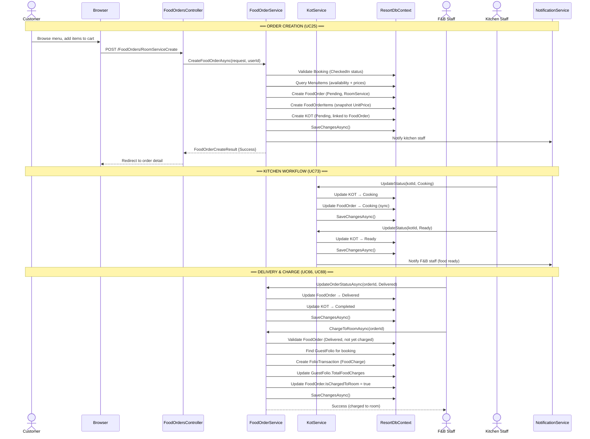
```mermaid
sequenceDiagram
    actor Customer
    participant Browser
    participant FoodCtrl as FoodOrdersController
    participant FoodSvc as FoodOrderService
    participant KotSvc as KotService
    participant DB as ResortDbContext
    actor FnBStaff as F&B Staff
    actor KitchenStaff as Kitchen Staff
    participant NotifSvc as NotificationService

    Note over Customer,NotifSvc: ══ ORDER CREATION (UC25) ══

    Customer->>Browser: Browse menu, add items to cart
    Browser->>FoodCtrl: POST /FoodOrders/RoomServiceCreate
    FoodCtrl->>FoodSvc: CreateFoodOrderAsync(request, userId)

    FoodSvc->>DB: Validate Booking (CheckedIn status)
    FoodSvc->>DB: Query MenuItems (availability + prices)
    FoodSvc->>DB: Create FoodOrder (Pending, RoomService)
    FoodSvc->>DB: Create FoodOrderItems (snapshot UnitPrice)
    FoodSvc->>DB: Create KOT (Pending, linked to FoodOrder)
    FoodSvc->>DB: SaveChangesAsync()
    FoodSvc->>NotifSvc: Notify kitchen staff
    FoodSvc-->>FoodCtrl: FoodOrderCreateResult {Success}
    FoodCtrl-->>Browser: Redirect to order detail

    Note over Customer,NotifSvc: ══ KITCHEN WORKFLOW (UC73) ══

    KitchenStaff->>KotSvc: UpdateStatus(kotId, Cooking)
    KotSvc->>DB: Update KOT → Cooking
    KotSvc->>DB: Update FoodOrder → Cooking (sync)
    KotSvc->>DB: SaveChangesAsync()

    KitchenStaff->>KotSvc: UpdateStatus(kotId, Ready)
    KotSvc->>DB: Update KOT → Ready
    KotSvc->>DB: SaveChangesAsync()
    KotSvc->>NotifSvc: Notify F&B staff (food ready)

    Note over Customer,NotifSvc: ══ DELIVERY & CHARGE (UC66, UC69) ══

    FnBStaff->>FoodSvc: UpdateOrderStatusAsync(orderId, Delivered)
    FoodSvc->>DB: Update FoodOrder → Delivered
    FoodSvc->>DB: Update KOT → Completed
    FoodSvc->>DB: SaveChangesAsync()

    FnBStaff->>FoodSvc: ChargeToRoomAsync(orderId)
    FoodSvc->>DB: Validate FoodOrder (Delivered, not yet charged)
    FoodSvc->>DB: Find GuestFolio for booking
    FoodSvc->>DB: Create FolioTransaction (FoodCharge)
    FoodSvc->>DB: Update GuestFolio.TotalFoodCharges
    FoodSvc->>DB: Update FoodOrder.IsChargedToRoom = true
    FoodSvc->>DB: SaveChangesAsync()
    FoodSvc-->>FnBStaff: Success (charged to room)
```

---

### 2.3.4 UC26 – Tour Booking & Payment

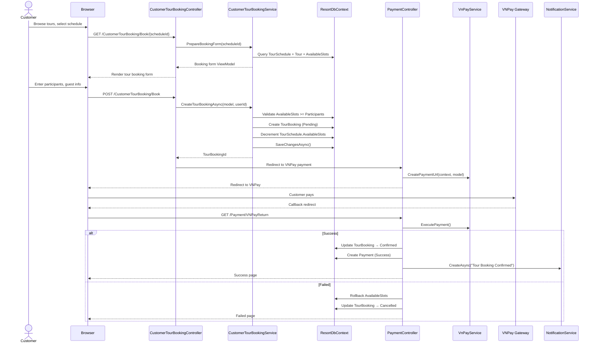
```mermaid
sequenceDiagram
    actor Customer
    participant Browser
    participant TourCtrl as CustomerTourBookingController
    participant TourSvc as CustomerTourBookingService
    participant DB as ResortDbContext
    participant PaymentCtrl as PaymentController
    participant VnPaySvc as VnPayService
    participant VNPay as VNPay Gateway
    participant NotifSvc as NotificationService

    Customer->>Browser: Browse tours, select schedule
    Browser->>TourCtrl: GET /CustomerTourBooking/Book/{scheduleId}
    TourCtrl->>TourSvc: PrepareBookingForm(scheduleId)
    TourSvc->>DB: Query TourSchedule + Tour + AvailableSlots
    TourSvc-->>TourCtrl: Booking form ViewModel
    TourCtrl-->>Browser: Render tour booking form

    Customer->>Browser: Enter participants, guest info
    Browser->>TourCtrl: POST /CustomerTourBooking/Book
    TourCtrl->>TourSvc: CreateTourBookingAsync(model, userId)

    TourSvc->>DB: Validate AvailableSlots >= Participants
    TourSvc->>DB: Create TourBooking (Pending)
    TourSvc->>DB: Decrement TourSchedule.AvailableSlots
    TourSvc->>DB: SaveChangesAsync()
    TourSvc-->>TourCtrl: TourBookingId

    TourCtrl->>PaymentCtrl: Redirect to VNPay payment
    PaymentCtrl->>VnPaySvc: CreatePaymentUrl(context, model)
    PaymentCtrl-->>Browser: Redirect to VNPay

    Browser->>VNPay: Customer pays
    VNPay-->>Browser: Callback redirect

    Browser->>PaymentCtrl: GET /Payment/VNPayReturn
    PaymentCtrl->>VnPaySvc: ExecutePayment()

    alt Success
        PaymentCtrl->>DB: Update TourBooking → Confirmed
        PaymentCtrl->>DB: Create Payment (Success)
        PaymentCtrl->>NotifSvc: CreateAsync("Tour Booking Confirmed")
        PaymentCtrl-->>Browser: Success page
    else Failed
        PaymentCtrl->>DB: Rollback AvailableSlots
        PaymentCtrl->>DB: Update TourBooking → Cancelled
        PaymentCtrl-->>Browser: Failed page
    end
```

---

### 2.3.5 UC21/UC01 – User Registration & Login

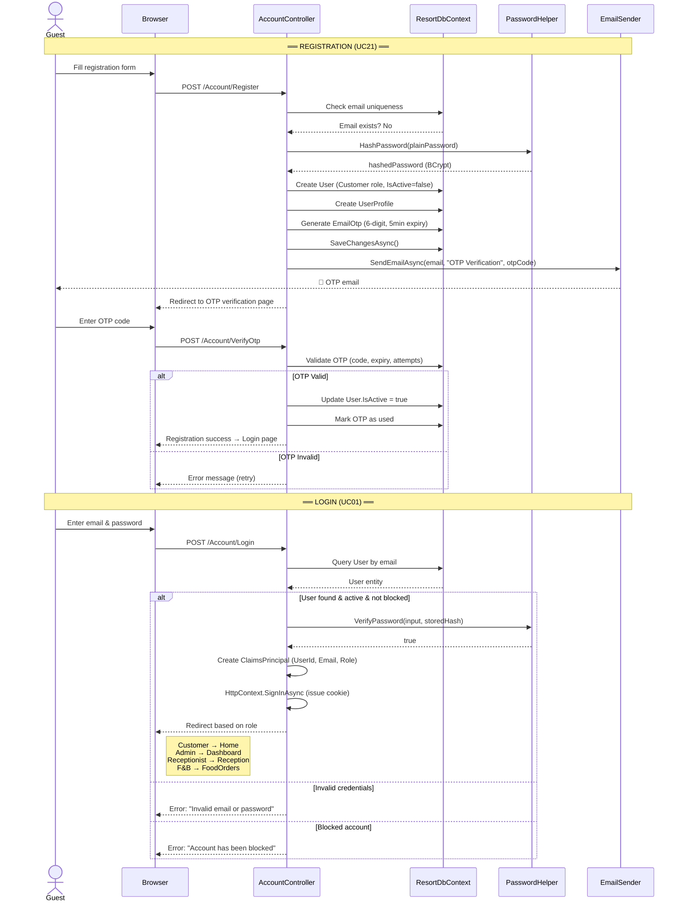
```mermaid
sequenceDiagram
    actor Guest
    participant Browser
    participant AccountCtrl as AccountController
    participant DB as ResortDbContext
    participant PwdHelper as PasswordHelper
    participant EmailSvc as EmailSender

    Note over Guest,EmailSvc: ══ REGISTRATION (UC21) ══

    Guest->>Browser: Fill registration form
    Browser->>AccountCtrl: POST /Account/Register
    AccountCtrl->>DB: Check email uniqueness
    DB-->>AccountCtrl: Email exists? No

    AccountCtrl->>PwdHelper: HashPassword(plainPassword)
    PwdHelper-->>AccountCtrl: hashedPassword (BCrypt)

    AccountCtrl->>DB: Create User (Customer role, IsActive=false)
    AccountCtrl->>DB: Create UserProfile
    AccountCtrl->>DB: Generate EmailOtp (6-digit, 5min expiry)
    AccountCtrl->>DB: SaveChangesAsync()

    AccountCtrl->>EmailSvc: SendEmailAsync(email, "OTP Verification", otpCode)
    EmailSvc-->>Guest: 📧 OTP email

    AccountCtrl-->>Browser: Redirect to OTP verification page

    Guest->>Browser: Enter OTP code
    Browser->>AccountCtrl: POST /Account/VerifyOtp
    AccountCtrl->>DB: Validate OTP (code, expiry, attempts)

    alt OTP Valid
        AccountCtrl->>DB: Update User.IsActive = true
        AccountCtrl->>DB: Mark OTP as used
        AccountCtrl-->>Browser: Registration success → Login page
    else OTP Invalid
        AccountCtrl-->>Browser: Error message (retry)
    end

    Note over Guest,EmailSvc: ══ LOGIN (UC01) ══

    Guest->>Browser: Enter email & password
    Browser->>AccountCtrl: POST /Account/Login

    AccountCtrl->>DB: Query User by email
    DB-->>AccountCtrl: User entity

    alt User found & active & not blocked
        AccountCtrl->>PwdHelper: VerifyPassword(input, storedHash)
        PwdHelper-->>AccountCtrl: true

        AccountCtrl->>AccountCtrl: Create ClaimsPrincipal (UserId, Email, Role)
        AccountCtrl->>AccountCtrl: HttpContext.SignInAsync (issue cookie)
        AccountCtrl-->>Browser: Redirect based on role
        Note right of Browser: Customer → Home<br/>Admin → Dashboard<br/>Receptionist → Reception<br/>F&B → FoodOrders
    else Invalid credentials
        AccountCtrl-->>Browser: Error: "Invalid email or password"
    else Blocked account
        AccountCtrl-->>Browser: Error: "Account has been blocked"
    end
```

---

> [!NOTE]
> **Document Convention**: All diagrams in this SDD are written in Mermaid syntax. All entity attributes, method signatures, and state transitions are derived from the actual source code implementation in the [PhucNguyenResort](file:///d:/SWP391_SU26/PRJ/su26-swp391-se2023-g1/PhucNguyenResort/PhucNguyenResort) project.

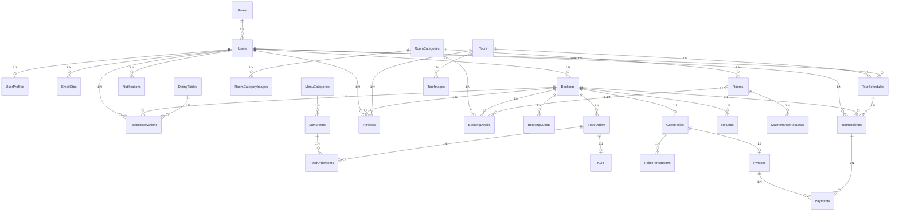
```mermaid
erDiagram
    Roles ||--o{ Users : "1:N"
    Users ||--o| UserProfiles : "1:1"
    Users ||--o{ EmailOtps : "1:N"
    Users ||--o{ Bookings : "1:N"
    Users ||--o{ TableReservations : "1:N"
    Users ||--o{ TourBookings : "1:N"
    Users ||--o{ Reviews : "1:N"
    Users ||--o{ Notifications : "1:N"

    RoomCategories ||--o{ Rooms : "1:N"
    RoomCategories ||--o{ RoomCategoryImages : "1:N"
    RoomCategories ||--o{ BookingDetails : "1:N"

    Bookings ||--o{ BookingDetails : "1:N"
    Bookings ||--o{ BookingGuests : "1:N"
    Bookings ||--o{ FoodOrders : "1:N"
    Bookings ||--o{ TableReservations : "1:N"
    Bookings ||--o{ TourBookings : "1:N"
    Bookings ||--o| GuestFolios : "1:1"
    Bookings ||--o{ Reviews : "1:N"
    Bookings ||--o{ Refunds : "1:N"

    Rooms }o--o{ BookingDetails : "0..1:N"
    Rooms ||--o{ MaintenanceRequests : "1:N"

    MenuCategories ||--o{ MenuItems : "1:N"
    MenuItems ||--o{ FoodOrderItems : "1:N"

    FoodOrders ||--o{ FoodOrderItems : "1:N"
    FoodOrders ||--o| KOT : "1:1"

    DiningTables ||--o{ TableReservations : "1:N"

    Tours ||--o{ TourSchedules : "1:N"
    Tours ||--o{ TourImages : "1:N"
    Tours ||--o{ Reviews : "1:N"
    TourSchedules ||--o{ TourBookings : "1:N"
    Users ||--o{ TourSchedules : "Guide 1:N"

    GuestFolios ||--o{ FolioTransactions : "1:N"
    GuestFolios ||--o| Invoices : "1:1"

    Invoices ||--o{ Payments : "1:N"
    TourBookings ||--o{ Payments : "1:N"
```
