# **SOFTWARE DESIGN SPECIFICATION**

**PhucNguyen Resort & Tour Hub (SWP391-HOS-02)**

**Version: 1.0**

– Hanoi, June 2026 –

---

**Table of Contents**

- [I. Record of Changes](#i-record-of-changes)
- [II. Software Design Document](#ii-software-design-document)
  - [1. High Level Design](#1-high-level-design)
    - [1.1 Software Architecture](#11-software-architecture)
    - [1.2 Package Diagram](#12-package-diagram)
    - [1.3 Database Design](#13-database-design)
  - [2. State Transition Diagrams](#2-state-transition-diagrams)
    - [2.1 Booking Status](#21-booking-status)
    - [2.2 Room Status](#22-room-status)
    - [2.3 Food Order Status](#23-food-order-status)
    - [2.4 KOT Status](#24-kot-status)
    - [2.5 Tour Booking Status](#25-tour-booking-status)
    - [2.6 Table Reservation Status](#26-table-reservation-status)
    - [2.7 Invoice Status](#27-invoice-status)
    - [2.8 Payment Status](#28-payment-status)
    - [2.9 Folio Status](#29-folio-status)
  - [3. Detailed Design](#3-detailed-design)
    - [3.1 Auth, Profiles &amp; Master Data](#31-auth-profiles--master-data)
    - [3.2 Room Reservation &amp; Front Desk](#32-room-reservation--front-desk)
    - [3.3 Restaurant POS &amp; Room Service](#33-restaurant-pos--room-service)
    - [3.4 Tour Booking &amp; Feedback System](#34-tour-booking--feedback-system)
    - [3.5 Consolidated Billing &amp; Dashboards](#35-consolidated-billing--dashboards)

---

# **I. Record of Changes**

| Date       | A*/M/D | In charge | Change Description                           |
| ---------- | ------ | --------- | -------------------------------------------- |
| 29/06/2026 | A      | Group 1   | Initial version – Full SDS document created |
|            |        |           |                                              |

\*A - Added M - Modified D - Deleted

---

# **II. Software Design Document**

## **1. High Level Design**

### **1.1 Software Architecture**

PhucNguyen Resort & Tour Hub is built using the **ASP.NET Core MVC** architectural pattern, targeting **.NET 8.0**. The system follows a **three-layer architecture** that separates concerns into Presentation, Business Logic, and Data Access layers.

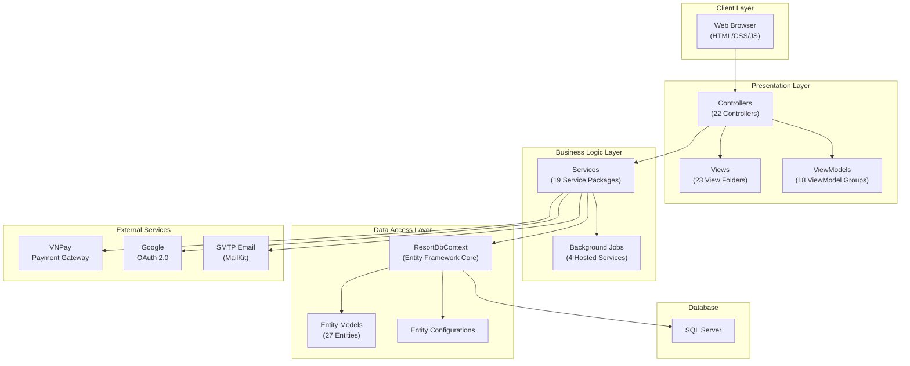
```mermaid
graph TB
    subgraph "Client Layer"
        Browser["Web Browser<br/>(HTML/CSS/JS)"]
    end

    subgraph "Presentation Layer"
        Controllers["Controllers<br/>(22 Controllers)"]
        Views["Views<br/>(23 View Folders)"]
        ViewModels["ViewModels<br/>(18 ViewModel Groups)"]
    end

    subgraph "Business Logic Layer"
        Services["Services<br/>(19 Service Packages)"]
        BackgroundJobs["Background Jobs<br/>(4 Hosted Services)"]
    end

    subgraph "Data Access Layer"
        DbContext["ResortDbContext<br/>(Entity Framework Core)"]
        Models["Entity Models<br/>(27 Entities)"]
        Configurations["Entity Configurations"]
    end

    subgraph "External Services"
        VNPay["VNPay<br/>Payment Gateway"]
        Google["Google<br/>OAuth 2.0"]
        EmailSMTP["SMTP Email<br/>(MailKit)"]
    end

    subgraph "Database"
        SQLServer["SQL Server"]
    end

    Browser --> Controllers
    Controllers --> Views
    Controllers --> ViewModels
    Controllers --> Services
    Services --> BackgroundJobs
    Services --> DbContext
    Services --> VNPay
    Services --> Google
    Services --> EmailSMTP
    DbContext --> Models
    DbContext --> Configurations
    DbContext --> SQLServer
```

#### Architecture Components Description

| No | Component                 | Technology              | Description                                                                                                                                               |
| -- | ------------------------- | ----------------------- | --------------------------------------------------------------------------------------------------------------------------------------------------------- |
| 01 | **Web Browser**     | HTML5, CSS3, JavaScript | Client-side user interface, responsible for rendering web pages and handling user interactions.                                                           |
| 02 | **Controllers**     | ASP.NET Core MVC        | 22 controllers handling HTTP requests, implementing application logic flow, managing request/response lifecycle, and enforcing authorization policies.    |
| 03 | **Views**           | Razor (.cshtml)         | 23 view directories containing Razor templates for rendering HTML pages with server-side data binding.                                                    |
| 04 | **ViewModels**      | C# Classes              | 18 ViewModel groups acting as data transfer objects between Controllers and Views, encapsulating presentation-specific data.                              |
| 05 | **Services**        | C# Classes (DI)         | 19 service packages implementing business logic, registered via Dependency Injection (Scoped lifetime). Each service has an interface and implementation. |
| 06 | **Background Jobs** | IHostedService          | 4 background hosted services:`PdpdDataPurgeJob`, `TourBookingCleanupJob`, `OtpCleanupJob`, `PendingBookingCleanupJob`.                            |
| 07 | **ResortDbContext** | EF Core 8.0             | Central database context managing 27 entity sets, applying entity configurations, and seeding initial data.                                               |
| 08 | **Entity Models**   | C# POCO Classes         | 27 entity models representing database tables with Data Annotation attributes for validation.                                                             |
| 09 | **SQL Server**      | MSSQL                   | Relational database storing all application data. Migrations applied automatically on startup.                                                            |
| 10 | **VNPay**           | Payment Gateway API     | External payment service for processing online deposits and final checkout payments.                                                                      |
| 11 | **Google OAuth**    | OAuth 2.0               | External authentication provider for Google sign-in support.                                                                                              |
| 12 | **SMTP Email**      | MailKit                 | Email service for sending booking confirmations, OTP verification, and notifications.                                                                     |

#### Authentication & Authorization

The system uses **Cookie-based Authentication** with the following configuration:

- Login Path: `/Account/Login`
- Access Denied Path: `/Account/AccessDenied`
- Cookie Name: `PhucNguyenResort.Auth`
- Session Expiration: 14 days (sliding)
- Blocked user detection: On each request validation, the system checks if the user is blocked and automatically signs them out.
- External Authentication: Google OAuth 2.0 using `ExternalCookie` scheme.

---

### **1.2 Package Diagram**

```mermaid
graph TB
    subgraph "PhucNguyenResort.Web"
        subgraph "Controllers Package"
            AC["AccountController"]
            BC["BookingsController"]
            CTBC["CustomerTourBookingController"]
            DC["DashboardController"]
            FOC["FoodOrdersController"]
            HC["HomeController"]
            MCC["MenuCategoriesController"]
            PC["PaymentController"]
            PRC["ProfileController"]
            RC["ReceptionController"]
            RFC["RefundsController"]
            RMC["RestaurantMenusController"]
            RVC["ReviewController"]
            RCCC["RoomCategoriesController"]
            ROC["RoomsController"]
            SAC["StaffAccountsController"]
            TFOC["TableFoodOrdersController"]
            TRC["TableReservationsController"]
            TC["TablesController"]
            TBC["TourBookingsController"]
            TSC["TourSchedulesController"]
            TOC["ToursController"]
        end

        subgraph "Services Package"
            SBackup["Backup"]
            SBookings["Bookings"]
            SEmail["Email"]
            SFoodOrders["FoodOrders"]
            SHome["Home"]
            SKots["Kots"]
            SMenuCat["MenuCategories"]
            SPayments["Payments"]
            SReception["Reception"]
            SRefunds["Refunds"]
            SRestMenu["RestaurantMenus"]
            SReviews["Reviews"]
            SRoomCat["RoomCategories"]
            SRooms["Rooms"]
            STableFO["TableFoodOrders"]
            STableRes["TableReservations"]
            STables["Tables"]
            STours["Tours"]
            SUsers["Users"]
        end

        subgraph "Models Package"
            M1["User, Role, UserProfile"]
            M2["Room, RoomCategory, RoomCategoryImage"]
            M3["Booking, BookingDetail, BookingGuest"]
            M4["MenuItem, MenuCategory, DiningTable"]
            M5["FoodOrder, FoodOrderItem, Kot"]
            M6["TableReservation"]
            M7["Tour, TourSchedule, TourBooking"]
            M8["Review, Notification, EmailOtp"]
            M9["GuestFolio, FolioTransaction, Invoice, Payment, Refund"]
        end

        subgraph "Enums Package"
            E1["BookingStatus, RoomStatus"]
            E2["FoodOrderStatus, FoodOrderType"]
            E3["KotStatus, DiningTableStatus"]
            E4["TableReservationStatus, TourBookingStatus"]
            E5["FolioStatus, FolioTransactionType"]
            E6["InvoiceStatus, PaymentStatus, PaymentMethod"]
            E7["RefundStatus, GenderType"]
        end

        subgraph "Data Package"
            DbCtx["ResortDbContext"]
            Seed["SeedData"]
            Mig["Migrations"]
        end

        subgraph "ViewModels Package"
            VM1["Auth, Users, Staff"]
            VM2["Bookings, Rooms, RoomCategories"]
            VM3["FoodOrders, TableFoodOrders, MenuCategories"]
            VM4["RestaurantMenus, Tables, TableReservations"]
            VM5["Tours, Reviews, Kots"]
            VM6["Payments, Dashboard, Backup"]
        end
    end
```

#### Package Descriptions

| No | Package                  | Description                                                                                                                                                                                                                                                   |
| -- | ------------------------ | ------------------------------------------------------------------------------------------------------------------------------------------------------------------------------------------------------------------------------------------------------------- |
| 01 | **Controllers**    | Contains 22 MVC controllers responsible for handling HTTP requests, processing user input, invoking service methods, and returning appropriate views or redirects. Each controller is mapped to a specific feature module.                                    |
| 02 | **Services**       | Contains 19 service sub-packages, each with an interface (e.g.,`IBookingService`) and implementation (e.g., `BookingService`). Services encapsulate all business logic and data access operations using the Repository pattern through EF Core DbContext. |
| 03 | **Models**         | Contains 27 POCO entity classes representing database tables. Models use Data Annotations for validation constraints (`[Required]`, `[StringLength]`, `[Range]`, `[EmailAddress]`).                                                                   |
| 04 | **Enums**          | Contains 15 enumeration types defining valid states and types for domain objects (e.g.,`BookingStatus`, `RoomStatus`, `FoodOrderStatus`, `KotStatus`).                                                                                                |
| 05 | **Data**           | Contains`ResortDbContext` (27 DbSets), `SeedData` (initial data seeding), and database migrations. Auto-migration is applied on application startup.                                                                                                      |
| 06 | **ViewModels**     | Contains 18 ViewModel sub-packages. ViewModels are used to pass data between Controllers and Views, often aggregating data from multiple entities.                                                                                                            |
| 07 | **Views**          | Contains 23 Razor view directories + shared layouts. Views implement the UI using Bootstrap and custom CSS.                                                                                                                                                   |
| 08 | **Helpers**        | Utility and helper classes for common operations across the application.                                                                                                                                                                                      |
| 09 | **Constants**      | Application-wide constant values.                                                                                                                                                                                                                             |
| 10 | **Configurations** | Entity Framework entity type configurations using Fluent API.                                                                                                                                                                                                 |

---

### **1.3 Database Design**

The database consists of **27 tables** managed by Entity Framework Core with SQL Server. The following describes each table and its fields.

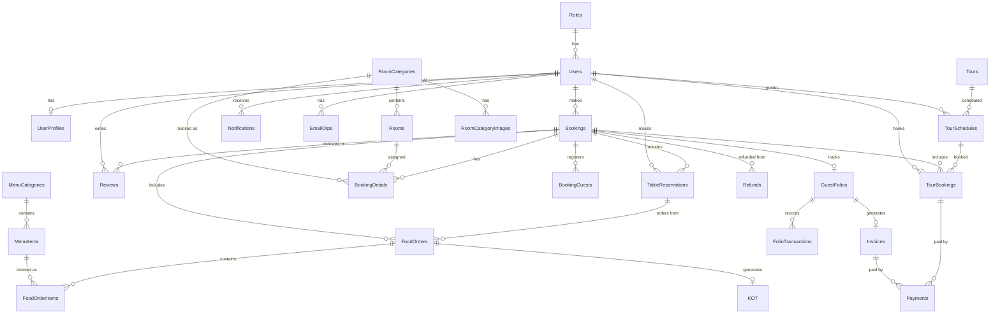
```mermaid
erDiagram
    Roles ||--o{ Users : has
    Users ||--o| UserProfiles : has
    Users ||--o{ Bookings : makes
    Users ||--o{ TableReservations : makes
    Users ||--o{ TourSchedules : guides
    Users ||--o{ Reviews : writes
    Users ||--o{ Notifications : receives
    Users ||--o{ TourBookings : books
    Users ||--o{ EmailOtps : has

    RoomCategories ||--o{ Rooms : contains
    RoomCategories ||--o{ RoomCategoryImages : has
    RoomCategories ||--o{ BookingDetails : "booked as"
    Rooms ||--o{ BookingDetails : assigned

    Bookings ||--o{ BookingDetails : has
    Bookings ||--o{ BookingGuests : registers
    Bookings ||--o{ FoodOrders : includes
    Bookings ||--o{ TableReservations : includes
    Bookings ||--o{ TourBookings : includes
    Bookings ||--o| GuestFolios : tracks
    Bookings ||--o{ Reviews : "reviewed in"
    Bookings ||--o{ Refunds : "refunded from"

    MenuCategories ||--o{ MenuItems : contains
    MenuItems ||--o{ FoodOrderItems : "ordered as"

    FoodOrders ||--o{ FoodOrderItems : contains
    FoodOrders ||--o| KOT : generates
    TableReservations ||--o{ FoodOrders : "orders from"

    Tours ||--o{ TourSchedules : scheduled
    TourSchedules ||--o{ TourBookings : booked

    GuestFolios ||--o{ FolioTransactions : records
    GuestFolios ||--o| Invoices : generates
    Invoices ||--o{ Payments : "paid by"
    TourBookings ||--o{ Payments : "paid by"
```

#### **1.3.1 Roles**

Stores system role definitions for Role-Based Access Control (RBAC).

| No | Field    | PK | FK | UN | NN | Description                                                                                                                                              |
| -- | -------- | -- | -- | -- | -- | -------------------------------------------------------------------------------------------------------------------------------------------------------- |
| 01 | RoleId   | ✓ |    |    | ✓ | Auto-increment primary key                                                                                                                               |
| 02 | RoleName |    |    | ✓ | ✓ | Unique role name (e.g., Admin, Customer, Receptionist, F&B Staff, Kitchen Staff, Housekeeping, Maintenance, Tour Guide, Business Manager). Max 50 chars. |

#### **1.3.2 Users**

Stores user account information including authentication credentials.

| No | Field        | PK | FK | UN | NN | Description                                                                            |
| -- | ------------ | -- | -- | -- | -- | -------------------------------------------------------------------------------------- |
| 01 | UserId       | ✓ |    |    | ✓ | Auto-increment primary key                                                             |
| 02 | FullName     |    |    |    | ✓ | User's full name. Max 100 chars.                                                       |
| 03 | Email        |    |    | ✓ | ✓ | User's email address, must be unique. Max 100 chars. Validated with`[EmailAddress]`. |
| 04 | PasswordHash |    |    |    | ✓ | Hashed password (never stored in plain text). Max 255 chars.                           |
| 05 | PhoneNumber  |    |    |    |    | Optional phone number. Max 20 chars. Validated with`[Phone]`.                        |
| 06 | RoleId       |    | ✓ |    | ✓ | Foreign key to`Roles(RoleId)`. Determines user permissions.                          |
| 07 | IsActive     |    |    |    | ✓ | Indicates if account is active. Default:`true`.                                      |
| 08 | IsBlocked    |    |    |    | ✓ | Indicates if account is blocked. Default:`false`. Blocked users are auto-signed-out. |
| 09 | CreatedAt    |    |    |    | ✓ | Account creation timestamp. Default:`DateTime.Now`.                                  |

#### **1.3.3 UserProfiles**

Stores extended user profile information including identity documents.

| No | Field           | PK | FK | UN | NN | Description                                               |
| -- | --------------- | -- | -- | -- | -- | --------------------------------------------------------- |
| 01 | ProfileId       | ✓ |    |    | ✓ | Auto-increment primary key                                |
| 02 | UserId          |    | ✓ | ✓ | ✓ | Foreign key to`Users(UserId)`. One-to-one relationship. |
| 03 | DateOfBirth     |    |    |    |    | User's date of birth                                      |
| 04 | Gender          |    |    |    |    | Gender (enum: Male, Female, Other)                        |
| 05 | Address         |    |    |    |    | User's address                                            |
| 06 | Nationality     |    |    |    |    | User's nationality                                        |
| 07 | PassportNumber  |    |    |    |    | CCCD/Passport number (encrypted storage)                  |
| 08 | ProfileImageUrl |    |    |    |    | URL to profile image                                      |

#### **1.3.4 EmailOtps**

Stores One-Time Password codes for email verification.

| No | Field     | PK | FK | UN | NN | Description                       |
| -- | --------- | -- | -- | -- | -- | --------------------------------- |
| 01 | Id        | ✓ |    |    | ✓ | Auto-increment primary key        |
| 02 | Email     |    |    |    | ✓ | Email address associated with OTP |
| 03 | OtpCode   |    |    |    | ✓ | The OTP code                      |
| 04 | ExpiresAt |    |    |    | ✓ | Expiration timestamp              |
| 05 | IsUsed    |    |    |    | ✓ | Whether OTP has been consumed     |

#### **1.3.5 RoomCategories**

Stores room category/type definitions with pricing and capacity.

| No | Field         | PK | FK | UN | NN | Description                                  |
| -- | ------------- | -- | -- | -- | -- | -------------------------------------------- |
| 01 | CategoryId    | ✓ |    |    | ✓ | Auto-increment primary key                   |
| 02 | CategoryName  |    |    |    | ✓ | Name of room category (e.g., Deluxe, Suite)  |
| 03 | Description   |    |    |    |    | Category description                         |
| 04 | MaxOccupancy  |    |    |    | ✓ | Maximum number of guests                     |
| 05 | PricePerNight |    |    |    | ✓ | Base price per night. Range: 0–999,999,999. |
| 06 | IsActive      |    |    |    | ✓ | Whether category is active for booking       |

#### **1.3.6 RoomCategoryImages**

Stores multiple images for each room category.

| No | Field      | PK | FK | UN | NN | Description                         |
| -- | ---------- | -- | -- | -- | -- | ----------------------------------- |
| 01 | ImageId    | ✓ |    |    | ✓ | Auto-increment primary key          |
| 02 | CategoryId |    | ✓ |    | ✓ | FK to`RoomCategories(CategoryId)` |
| 03 | ImageUrl   |    |    |    | ✓ | URL of the image                    |

#### **1.3.7 Rooms**

Stores individual physical room information.

| No | Field       | PK | FK | UN | NN | Description                                                                                             |
| -- | ----------- | -- | -- | -- | -- | ------------------------------------------------------------------------------------------------------- |
| 01 | RoomId      | ✓ |    |    | ✓ | Auto-increment primary key                                                                              |
| 02 | RoomNumber  |    |    | ✓ |    | Room number identifier. Max 20 chars.                                                                   |
| 03 | CategoryId  |    | ✓ |    | ✓ | FK to`RoomCategories(CategoryId)`                                                                     |
| 04 | FloorNumber |    |    |    |    | Floor number. Range: 0–200.                                                                            |
| 05 | Status      |    |    |    | ✓ | Room operational status (enum: Available, Occupied, Maintenance, NeedsCleaning). Default:`Available`. |

#### **1.3.8 Bookings**

Stores room booking/reservation records.

| No | Field               | PK | FK | UN | NN | Description                                                                                                               |
| -- | ------------------- | -- | -- | -- | -- | ------------------------------------------------------------------------------------------------------------------------- |
| 01 | BookingId           | ✓ |    |    | ✓ | Auto-increment primary key                                                                                                |
| 02 | UserId              |    | ✓ |    | ✓ | FK to`Users(UserId)`. The customer who made the booking.                                                                |
| 03 | CheckInDate         |    |    |    | ✓ | Expected check-in date                                                                                                    |
| 04 | CheckOutDate        |    |    |    | ✓ | Expected check-out date                                                                                                   |
| 05 | NumberOfAdults      |    |    |    |    | Number of adult guests. Range: 1–20.                                                                                     |
| 06 | NumberOfChildren    |    |    |    |    | Number of child guests. Range: 0–10.                                                                                     |
| 07 | BookingStatus       |    |    |    | ✓ | Booking status (enum: Reserved, Arrived, CheckedIn, CheckedOut, Cancelled, NoShow, PendingPayment). Default:`Reserved`. |
| 08 | DepositAmount       |    |    |    |    | Deposit amount. Range: 0–999,999,999.                                                                                    |
| 09 | TotalAmount         |    |    |    |    | Total estimated cost. Range: 0–999,999,999.                                                                              |
| 10 | CreatedAt           |    |    |    | ✓ | Booking creation timestamp                                                                                                |
| 11 | PdpdConsentChecked  |    |    |    | ✓ | PDPA consent flag (Decree 356/2025 compliance)                                                                            |
| 12 | ConsentTimestamp    |    |    |    |    | Timestamp when consent was given                                                                                          |
| 13 | ExpectedArrivalTime |    |    |    |    | Expected arrival time                                                                                                     |
| 14 | ActualCheckInTime   |    |    |    |    | Actual check-in timestamp                                                                                                 |
| 15 | RoomHandoverTime    |    |    |    |    | Room key handover timestamp                                                                                               |
| 16 | ActualCheckOutTime  |    |    |    |    | Actual check-out timestamp                                                                                                |

#### **1.3.9 BookingDetails**

Links bookings to room categories and assigned rooms.

| No | Field           | PK | FK | UN | NN | Description                                                   |
| -- | --------------- | -- | -- | -- | -- | ------------------------------------------------------------- |
| 01 | BookingDetailId | ✓ |    |    | ✓ | Auto-increment primary key                                    |
| 02 | BookingId       |    | ✓ |    | ✓ | FK to`Bookings(BookingId)`                                  |
| 03 | RoomCategoryId  |    | ✓ |    | ✓ | FK to`RoomCategories(CategoryId)`                           |
| 04 | RoomId          |    | ✓ |    |    | FK to`Rooms(RoomId)`. Nullable — assigned during check-in. |

#### **1.3.10 BookingGuests**

Stores guest registration information for stay registration compliance.

| No | Field          | PK | FK | UN | NN | Description                  |
| -- | -------------- | -- | -- | -- | -- | ---------------------------- |
| 01 | BookingGuestId | ✓ |    |    | ✓ | Auto-increment primary key   |
| 02 | BookingId      |    | ✓ |    | ✓ | FK to`Bookings(BookingId)` |
| 03 | FullName       |    |    |    | ✓ | Guest full name              |
| 04 | DateOfBirth    |    |    |    |    | Guest date of birth          |
| 05 | Nationality    |    |    |    |    | Guest nationality            |
| 06 | PassportNumber |    |    |    |    | CCCD/Passport number         |
| 07 | Gender         |    |    |    |    | Guest gender                 |

#### **1.3.11 MenuCategories**

Stores food/beverage menu categories.

| No | Field        | PK | FK | UN | NN | Description                                            |
| -- | ------------ | -- | -- | -- | -- | ------------------------------------------------------ |
| 01 | CategoryId   | ✓ |    |    | ✓ | Auto-increment primary key                             |
| 02 | CategoryName |    |    |    | ✓ | Category name (e.g., Appetizer, Main Course, Beverage) |
| 03 | Description  |    |    |    |    | Category description                                   |
| 04 | IsActive     |    |    |    | ✓ | Whether category is active                             |

#### **1.3.12 MenuItems**

Stores individual food/beverage items.

| No | Field       | PK | FK | UN | NN | Description                                      |
| -- | ----------- | -- | -- | -- | -- | ------------------------------------------------ |
| 01 | MenuItemId  | ✓ |    |    | ✓ | Auto-increment primary key                       |
| 02 | CategoryId  |    | ✓ |    | ✓ | FK to`MenuCategories(CategoryId)`              |
| 03 | ItemName    |    |    |    | ✓ | Name of the menu item                            |
| 04 | Description |    |    |    |    | Item description                                 |
| 05 | Price       |    |    |    | ✓ | Unit price. Range: 0–999,999,999.               |
| 06 | ImageUrl    |    |    |    |    | Image URL                                        |
| 07 | IsAvailable |    |    |    | ✓ | Whether item is currently available for ordering |

#### **1.3.13 DiningTables**

Stores restaurant table information.

| No | Field       | PK | FK | UN | NN | Description                                                                             |
| -- | ----------- | -- | -- | -- | -- | --------------------------------------------------------------------------------------- |
| 01 | TableId     | ✓ |    |    | ✓ | Auto-increment primary key                                                              |
| 02 | TableNumber |    |    | ✓ | ✓ | Unique table number                                                                     |
| 03 | Capacity    |    |    |    | ✓ | Maximum seating capacity                                                                |
| 04 | Location    |    |    |    |    | Table location (e.g., Indoor, Outdoor, VIP)                                             |
| 05 | Status      |    |    |    | ✓ | Table status (enum: Available, Occupied, Reserved, Maintenance). Default:`Available`. |

#### **1.3.14 TableReservations**

Stores restaurant table reservation records.

| No | Field           | PK | FK | UN | NN | Description                                                                         |
| -- | --------------- | -- | -- | -- | -- | ----------------------------------------------------------------------------------- |
| 01 | ReservationId   | ✓ |    |    | ✓ | Auto-increment primary key                                                          |
| 02 | UserId          |    | ✓ |    | ✓ | FK to`Users(UserId)`                                                              |
| 03 | TableId         |    | ✓ |    | ✓ | FK to`DiningTables(TableId)`                                                      |
| 04 | BookingId       |    | ✓ |    |    | FK to`Bookings(BookingId)`. Optional.                                             |
| 05 | ReservationDate |    |    |    | ✓ | Date of reservation                                                                 |
| 06 | StartTime       |    |    |    | ✓ | Reservation start time                                                              |
| 07 | EndTime         |    |    |    | ✓ | Reservation end time                                                                |
| 08 | NumberOfGuests  |    |    |    | ✓ | Number of guests                                                                    |
| 09 | Status          |    |    |    | ✓ | Reservation status (enum: Pending, Confirmed, Seated, Completed, Cancelled, NoShow) |
| 10 | SpecialRequests |    |    |    |    | Customer special requests                                                           |

#### **1.3.15 FoodOrders**

Stores food order records for room service and table orders.

| No | Field               | PK | FK | UN | NN | Description                                                                       |
| -- | ------------------- | -- | -- | -- | -- | --------------------------------------------------------------------------------- |
| 01 | FoodOrderId         | ✓ |    |    | ✓ | Auto-increment primary key                                                        |
| 02 | OrderType           |    |    |    | ✓ | Type of order (enum: RoomService, TableOrder). Default:`RoomService`.           |
| 03 | BookingId           |    | ✓ |    |    | FK to`Bookings(BookingId)`. For room service orders.                            |
| 04 | BookingDetailId     |    | ✓ |    |    | FK to`BookingDetails(BookingDetailId)`. Links to specific room.                 |
| 05 | TableReservationId  |    | ✓ |    |    | FK to`TableReservations(ReservationId)`. For table orders.                      |
| 06 | OrderStatus         |    |    |    | ✓ | Order status (enum: Pending, Cooking, Delivered, Cancelled). Default:`Pending`. |
| 07 | TotalAmount         |    |    |    |    | Total order amount. Range: 0–999,999,999.                                        |
| 08 | OrderedAt           |    |    |    | ✓ | Order creation timestamp                                                          |
| 09 | RequestedDeliveryAt |    |    |    |    | Requested delivery time                                                           |
| 10 | CustomerNote        |    |    |    |    | Special customer notes                                                            |
| 11 | IsChargedToRoom     |    |    |    | ✓ | Whether charge is posted to room folio. Default:`false`.                        |
| 12 | ChargedAt           |    |    |    |    | Timestamp when charged to room                                                    |
| 13 | IsPaidAtRestaurant  |    |    |    | ✓ | Whether paid directly at restaurant. Default:`false`.                           |
| 14 | PaidAt              |    |    |    |    | Payment timestamp                                                                 |

#### **1.3.16 FoodOrderItems**

Stores individual line items within a food order.

| No | Field       | PK | FK | UN | NN | Description                      |
| -- | ----------- | -- | -- | -- | -- | -------------------------------- |
| 01 | OrderItemId | ✓ |    |    | ✓ | Auto-increment primary key       |
| 02 | FoodOrderId |    | ✓ |    | ✓ | FK to`FoodOrders(FoodOrderId)` |
| 03 | MenuItemId  |    | ✓ |    | ✓ | FK to`MenuItems(MenuItemId)`   |
| 04 | Quantity    |    |    |    | ✓ | Quantity ordered. Range: 1+.     |
| 05 | UnitPrice   |    |    |    | ✓ | Snapshot price at time of order  |
| 06 | Subtotal    |    |    |    | ✓ | Quantity × UnitPrice            |

#### **1.3.17 KOT (Kitchen Order Tickets)**

Stores kitchen order ticket records linked to food orders.

| No | Field       | PK | FK | UN | NN | Description                                                                            |
| -- | ----------- | -- | -- | -- | -- | -------------------------------------------------------------------------------------- |
| 01 | KotId       | ✓ |    |    | ✓ | Auto-increment primary key                                                             |
| 02 | FoodOrderId |    | ✓ | ✓ | ✓ | FK to`FoodOrders(FoodOrderId)`. One-to-one.                                          |
| 03 | Status      |    |    |    | ✓ | KOT status (enum: Pending, Cooking, Ready, Completed, Cancelled). Default:`Pending`. |
| 04 | CreatedAt   |    |    |    | ✓ | KOT creation timestamp                                                                 |

#### **1.3.18 Tours**

Stores tour/activity package definitions.

| No | Field       | PK | FK | UN | NN | Description                              |
| -- | ----------- | -- | -- | -- | -- | ---------------------------------------- |
| 01 | TourId      | ✓ |    |    | ✓ | Auto-increment primary key               |
| 02 | TourName    |    |    |    | ✓ | Name of the tour                         |
| 03 | Description |    |    |    |    | Tour description and itinerary           |
| 04 | Duration    |    |    |    |    | Tour duration                            |
| 05 | Price       |    |    |    | ✓ | Price per person. Range: 0–999,999,999. |
| 06 | MaxCapacity |    |    |    | ✓ | Maximum participants per schedule        |
| 07 | ImageUrl    |    |    |    |    | Tour image URL                           |
| 08 | IsActive    |    |    |    | ✓ | Whether tour is available for booking    |

#### **1.3.19 TourSchedules**

Stores specific tour schedule instances.

| No | Field          | PK | FK | UN | NN | Description                                  |
| -- | -------------- | -- | -- | -- | -- | -------------------------------------------- |
| 01 | ScheduleId     | ✓ |    |    | ✓ | Auto-increment primary key                   |
| 02 | TourId         |    | ✓ |    | ✓ | FK to`Tours(TourId)`                       |
| 03 | GuideId        |    | ✓ |    |    | FK to`Users(UserId)`. Assigned tour guide. |
| 04 | ScheduleDate   |    |    |    | ✓ | Date of the tour                             |
| 05 | StartTime      |    |    |    | ✓ | Tour start time                              |
| 06 | AvailableSlots |    |    |    | ✓ | Remaining available slots                    |

#### **1.3.20 TourBookings**

Stores customer tour booking records.

| No | Field                      | PK | FK | UN | NN | Description                                                                   |
| -- | -------------------------- | -- | -- | -- | -- | ----------------------------------------------------------------------------- |
| 01 | TourBookingId              | ✓ |    |    | ✓ | Auto-increment primary key                                                    |
| 02 | BookingId                  |    | ✓ |    |    | FK to`Bookings(BookingId)`. Nullable — can be standalone.                  |
| 03 | UserId                     |    | ✓ |    |    | FK to`Users(UserId)`                                                        |
| 04 | ScheduleId                 |    | ✓ |    | ✓ | FK to`TourSchedules(ScheduleId)`                                            |
| 05 | Participants               |    |    |    |    | Number of participants. Range: 1–1000.                                       |
| 06 | TotalAmount                |    |    |    |    | Total amount. Range: 0–999,999,999.                                          |
| 07 | BookingStatus              |    |    |    | ✓ | Status (enum: Pending, Confirmed, Completed, Cancelled). Default:`Pending`. |
| 08 | CancellationReason         |    |    |    |    | Reason for cancellation. Max 500 chars.                                       |
| 09 | PrimaryGuestName           |    |    |    |    | Primary guest name. Max 100 chars.                                            |
| 10 | PrimaryGuestDateOfBirth    |    |    |    |    | Primary guest date of birth                                                   |
| 11 | PrimaryGuestGender         |    |    |    |    | Primary guest gender                                                          |
| 12 | PrimaryGuestPassportNumber |    |    |    |    | Primary guest passport. Max 500 chars.                                        |
| 13 | PrimaryGuestNationality    |    |    |    |    | Primary guest nationality. Max 50 chars.                                      |
| 14 | CreatedAt                  |    |    |    | ✓ | Creation timestamp                                                            |

#### **1.3.21 Reviews**

Stores customer reviews and ratings.

| No | Field      | PK | FK | UN | NN | Description                           |
| -- | ---------- | -- | -- | -- | -- | ------------------------------------- |
| 01 | ReviewId   | ✓ |    |    | ✓ | Auto-increment primary key            |
| 02 | UserId     |    | ✓ |    | ✓ | FK to`Users(UserId)`                |
| 03 | BookingId  |    | ✓ |    |    | FK to`Bookings(BookingId)`          |
| 04 | Rating     |    |    |    | ✓ | Star rating (1–5)                    |
| 05 | Comment    |    |    |    |    | Written review content                |
| 06 | CreatedAt  |    |    |    | ✓ | Review submission timestamp           |
| 07 | IsApproved |    |    |    | ✓ | Moderation status. Default:`false`. |

#### **1.3.22 GuestFolios**

Stores consolidated billing folios for each guest stay.

| No | Field            | PK | FK | UN | NN | Description                                                                              |
| -- | ---------------- | -- | -- | -- | -- | ---------------------------------------------------------------------------------------- |
| 01 | FolioId          | ✓ |    |    | ✓ | Auto-increment primary key                                                               |
| 02 | BookingId        |    | ✓ | ✓ |    | FK to`Bookings(BookingId)`. One-to-one.                                                |
| 03 | TotalRoomCharges |    |    |    | ✓ | Total room charges. Default: 0.                                                          |
| 04 | TotalFoodCharges |    |    |    | ✓ | Total food charges. Default: 0.                                                          |
| 05 | TotalTourCharges |    |    |    | ✓ | Total tour charges. Default: 0.                                                          |
| 06 | TotalAmount      |    |    |    | ✓ | Grand total. Default: 0.                                                                 |
| 07 | Status           |    |    |    | ✓ | Folio status (enum: Unpaid, PartialPaid, Paid, Refunded, Cancelled). Default:`Unpaid`. |

#### **1.3.23 FolioTransactions**

Records individual charge/payment transactions on a folio.

| No | Field           | PK | FK | UN | NN | Description                                                                  |
| -- | --------------- | -- | -- | -- | -- | ---------------------------------------------------------------------------- |
| 01 | TransactionId   | ✓ |    |    | ✓ | Auto-increment primary key                                                   |
| 02 | FolioId         |    | ✓ |    | ✓ | FK to`GuestFolios(FolioId)`                                                |
| 03 | TransactionType |    |    |    | ✓ | Type (enum: RoomCharge, FoodCharge, TourCharge, Payment, Refund, Adjustment) |
| 04 | Amount          |    |    |    | ✓ | Transaction amount                                                           |
| 05 | Description     |    |    |    |    | Transaction description                                                      |
| 06 | CreatedAt       |    |    |    | ✓ | Transaction timestamp                                                        |

#### **1.3.24 Invoices**

Stores consolidated invoices generated at checkout.

| No | Field         | PK | FK | UN | NN | Description                                                       |
| -- | ------------- | -- | -- | -- | -- | ----------------------------------------------------------------- |
| 01 | InvoiceId     | ✓ |    |    | ✓ | Auto-increment primary key                                        |
| 02 | FolioId       |    | ✓ | ✓ | ✓ | FK to`GuestFolios(FolioId)`. One-to-one.                        |
| 03 | InvoiceNumber |    |    |    |    | Auto-generated invoice number. Max 50 chars.                      |
| 04 | TotalAmount   |    |    |    |    | Pre-tax total. Range: 0–999,999,999.                             |
| 05 | TaxAmount     |    |    |    |    | Tax amount. Range: 0–999,999,999.                                |
| 06 | FinalAmount   |    |    |    |    | Final amount after tax. Range: 0–999,999,999.                    |
| 07 | InvoiceStatus |    |    |    | ✓ | Status (enum: Draft, Issued, Paid, Cancelled). Default:`Draft`. |
| 08 | IssuedAt      |    |    |    | ✓ | Invoice issue timestamp                                           |

#### **1.3.25 Payments**

Stores payment transaction records.

| No | Field           | PK | FK | UN | NN | Description                                                           |
| -- | --------------- | -- | -- | -- | -- | --------------------------------------------------------------------- |
| 01 | PaymentId       | ✓ |    |    | ✓ | Auto-increment primary key                                            |
| 02 | InvoiceId       |    | ✓ |    |    | FK to`Invoices(InvoiceId)`. Nullable.                               |
| 03 | TourBookingId   |    | ✓ |    |    | FK to`TourBookings(TourBookingId)`. Nullable.                       |
| 04 | PaymentMethod   |    |    |    |    | Method (enum: Cash, CreditCard, DebitCard, VNPay, MoMo, BankTransfer) |
| 05 | Amount          |    |    |    |    | Payment amount. Range: 0–999,999,999.                                |
| 06 | PaymentStatus   |    |    |    |    | Status (enum: Pending, Success, Failed, Refunded)                     |
| 07 | TransactionCode |    |    |    |    | External transaction code (VNPay). Max 100 chars.                     |
| 08 | PaidAt          |    |    |    |    | Payment timestamp                                                     |

#### **1.3.26 Refunds**

Stores refund records for cancelled bookings.

| No | Field        | PK | FK | UN | NN | Description                                           |
| -- | ------------ | -- | -- | -- | -- | ----------------------------------------------------- |
| 01 | RefundId     | ✓ |    |    | ✓ | Auto-increment primary key                            |
| 02 | BookingId    |    | ✓ |    | ✓ | FK to`Bookings(BookingId)`                          |
| 03 | Amount       |    |    |    | ✓ | Refund amount                                         |
| 04 | RefundStatus |    |    |    | ✓ | Status (enum: Pending, Approved, Completed, Rejected) |
| 05 | Reason       |    |    |    |    | Refund reason                                         |
| 06 | CreatedAt    |    |    |    | ✓ | Refund request timestamp                              |

#### **1.3.27 Notifications**

Stores system notifications for users.

| No | Field          | PK | FK | UN | NN | Description                |
| -- | -------------- | -- | -- | -- | -- | -------------------------- |
| 01 | NotificationId | ✓ |    |    | ✓ | Auto-increment primary key |
| 02 | UserId         |    | ✓ |    | ✓ | FK to`Users(UserId)`     |
| 03 | Title          |    |    |    | ✓ | Notification title         |
| 04 | Message        |    |    |    | ✓ | Notification content       |
| 05 | IsRead         |    |    |    | ✓ | Read status                |
| 06 | CreatedAt      |    |    |    | ✓ | Creation timestamp         |

---

## **2. State Transition Diagrams**

### **2.1 Booking Status**

Defines the lifecycle of a room booking from creation to completion.

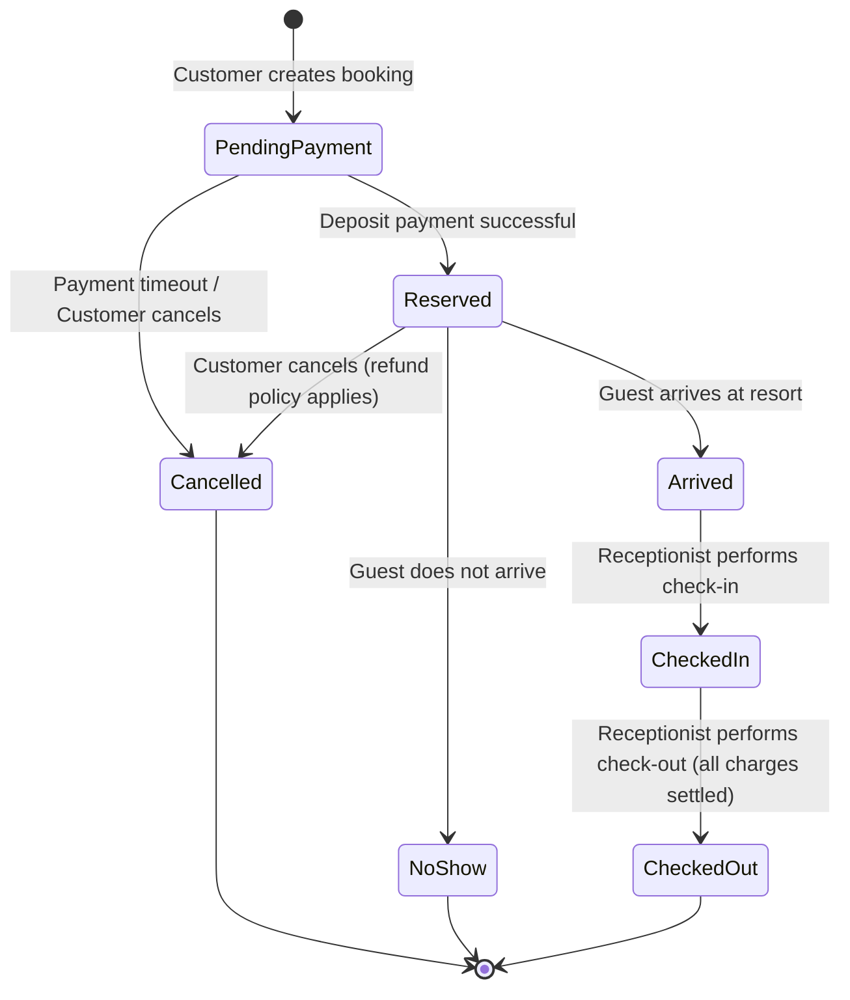
```mermaid
stateDiagram-v2
    [*] --> PendingPayment : Customer creates booking
    PendingPayment --> Reserved : Deposit payment successful
    PendingPayment --> Cancelled : Payment timeout / Customer cancels
    Reserved --> Arrived : Guest arrives at resort
    Reserved --> Cancelled : Customer cancels (refund policy applies)
    Reserved --> NoShow : Guest does not arrive
    Arrived --> CheckedIn : Receptionist performs check-in
    CheckedIn --> CheckedOut : Receptionist performs check-out (all charges settled)
    Cancelled --> [*]
    NoShow --> [*]
    CheckedOut --> [*]
```

**States:**

| State          | Description                                                                           |
| -------------- | ------------------------------------------------------------------------------------- |
| PendingPayment | Booking created, awaiting deposit payment                                             |
| Reserved       | Deposit paid, booking confirmed                                                       |
| Arrived        | Guest has arrived at the resort                                                       |
| CheckedIn      | Guest checked in, room assigned and occupied                                          |
| CheckedOut     | Guest checked out, all charges settled                                                |
| Cancelled      | Booking cancelled (refund policy applies: 100% if >48h before check-in, 0% otherwise) |
| NoShow         | Guest did not arrive                                                                  |

### **2.2 Room Status**

Defines the operational lifecycle of a physical room.

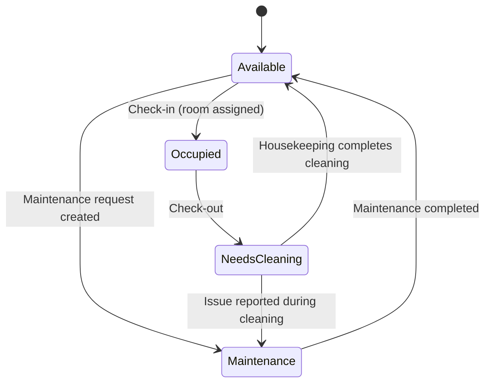
```mermaid
stateDiagram-v2
    [*] --> Available
    Available --> Occupied : Check-in (room assigned)
    Occupied --> NeedsCleaning : Check-out
    NeedsCleaning --> Available : Housekeeping completes cleaning
    Available --> Maintenance : Maintenance request created
    NeedsCleaning --> Maintenance : Issue reported during cleaning
    Maintenance --> Available : Maintenance completed
```

**States:**

| State         | Description                                             |
| ------------- | ------------------------------------------------------- |
| Available     | Room is clean and ready for new guests                  |
| Occupied      | Room is currently occupied by a checked-in guest        |
| NeedsCleaning | Guest has checked out; room requires cleaning           |
| Maintenance   | Room is under maintenance; cannot be booked or assigned |

### **2.3 Food Order Status**

Defines the lifecycle of a food order (room service or table order).

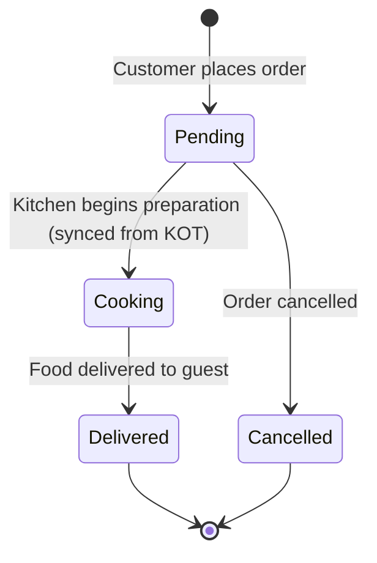
```mermaid
stateDiagram-v2
    [*] --> Pending : Customer places order
    Pending --> Cooking : Kitchen begins preparation (synced from KOT)
    Cooking --> Delivered : Food delivered to guest
    Pending --> Cancelled : Order cancelled
    Delivered --> [*]
    Cancelled --> [*]
```

**States:**

| State     | Description                                             |
| --------- | ------------------------------------------------------- |
| Pending   | Order placed, waiting for kitchen acknowledgment        |
| Cooking   | Kitchen is preparing the order (synced from KOT status) |
| Delivered | Food has been delivered to the guest                    |
| Cancelled | Order has been cancelled                                |

### **2.4 KOT Status**

Defines the Kitchen Order Ticket workflow.

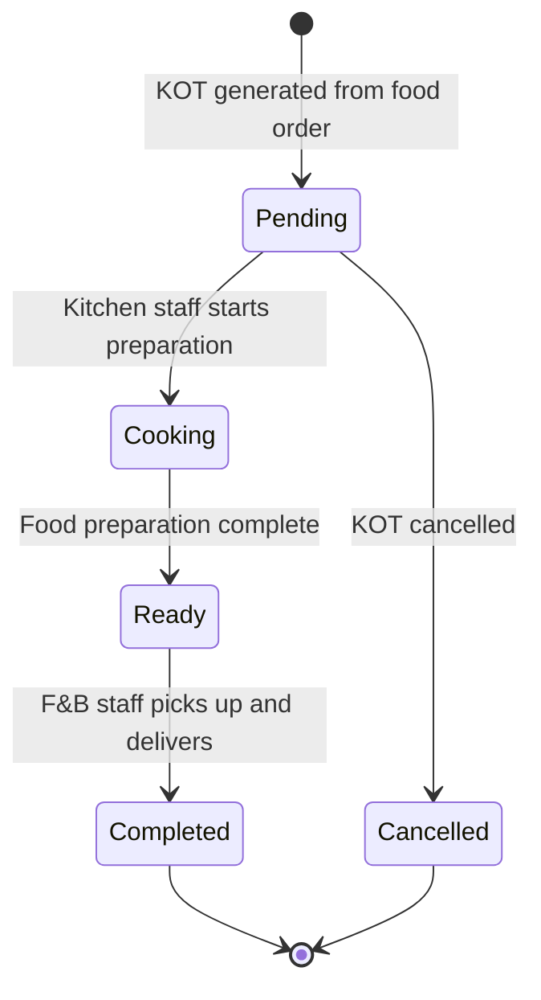
```mermaid
stateDiagram-v2
    [*] --> Pending : KOT generated from food order
    Pending --> Cooking : Kitchen staff starts preparation
    Cooking --> Ready : Food preparation complete
    Ready --> Completed : F&B staff picks up and delivers
    Pending --> Cancelled : KOT cancelled
    Completed --> [*]
    Cancelled --> [*]
```

**States:**

| State     | Description                               |
| --------- | ----------------------------------------- |
| Pending   | KOT created, waiting for kitchen to start |
| Cooking   | Kitchen staff is preparing the food       |
| Ready     | Food is ready for pickup/delivery         |
| Completed | Order has been served to the guest        |
| Cancelled | KOT has been cancelled                    |

### **2.5 Tour Booking Status**

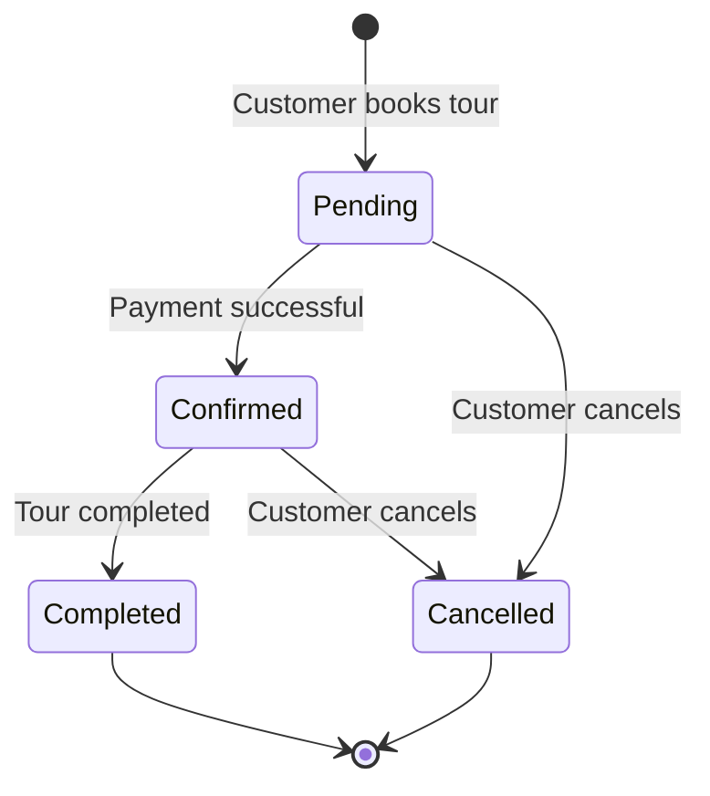
```mermaid
stateDiagram-v2
    [*] --> Pending : Customer books tour
    Pending --> Confirmed : Payment successful
    Confirmed --> Completed : Tour completed
    Pending --> Cancelled : Customer cancels
    Confirmed --> Cancelled : Customer cancels
    Completed --> [*]
    Cancelled --> [*]
```

### **2.6 Table Reservation Status**

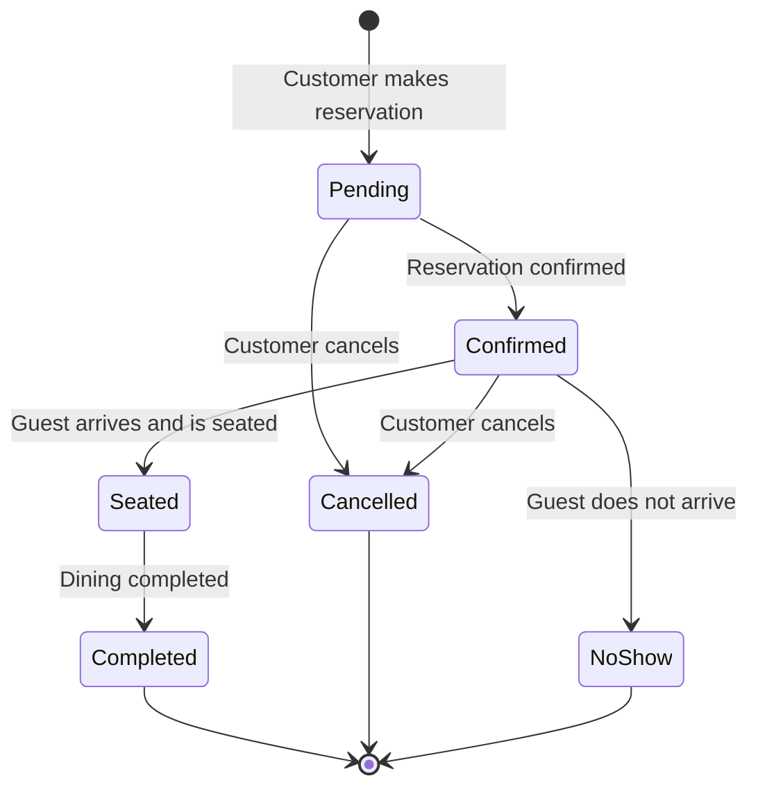
```mermaid
stateDiagram-v2
    [*] --> Pending : Customer makes reservation
    Pending --> Confirmed : Reservation confirmed
    Confirmed --> Seated : Guest arrives and is seated
    Seated --> Completed : Dining completed
    Pending --> Cancelled : Customer cancels
    Confirmed --> Cancelled : Customer cancels
    Confirmed --> NoShow : Guest does not arrive
    Completed --> [*]
    Cancelled --> [*]
    NoShow --> [*]
```

### **2.7 Invoice Status**

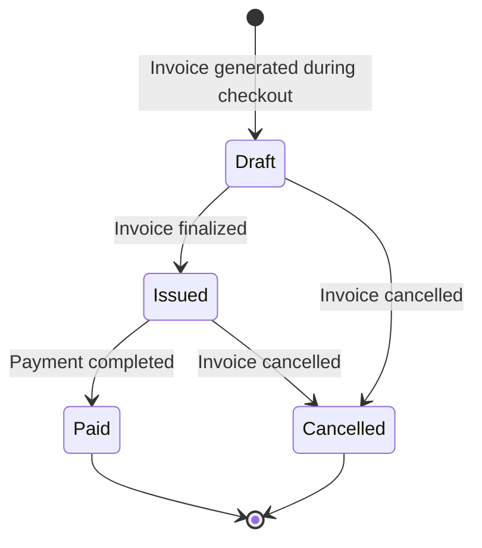
```mermaid
stateDiagram-v2
    [*] --> Draft : Invoice generated during checkout
    Draft --> Issued : Invoice finalized
    Issued --> Paid : Payment completed
    Draft --> Cancelled : Invoice cancelled
    Issued --> Cancelled : Invoice cancelled
    Paid --> [*]
    Cancelled --> [*]
```

### **2.8 Payment Status**

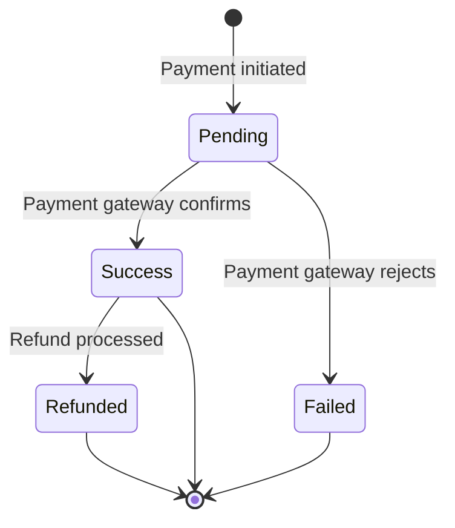
```mermaid
stateDiagram-v2
    [*] --> Pending : Payment initiated
    Pending --> Success : Payment gateway confirms
    Pending --> Failed : Payment gateway rejects
    Success --> Refunded : Refund processed
    Success --> [*]
    Failed --> [*]
    Refunded --> [*]
```

### **2.9 Folio Status**

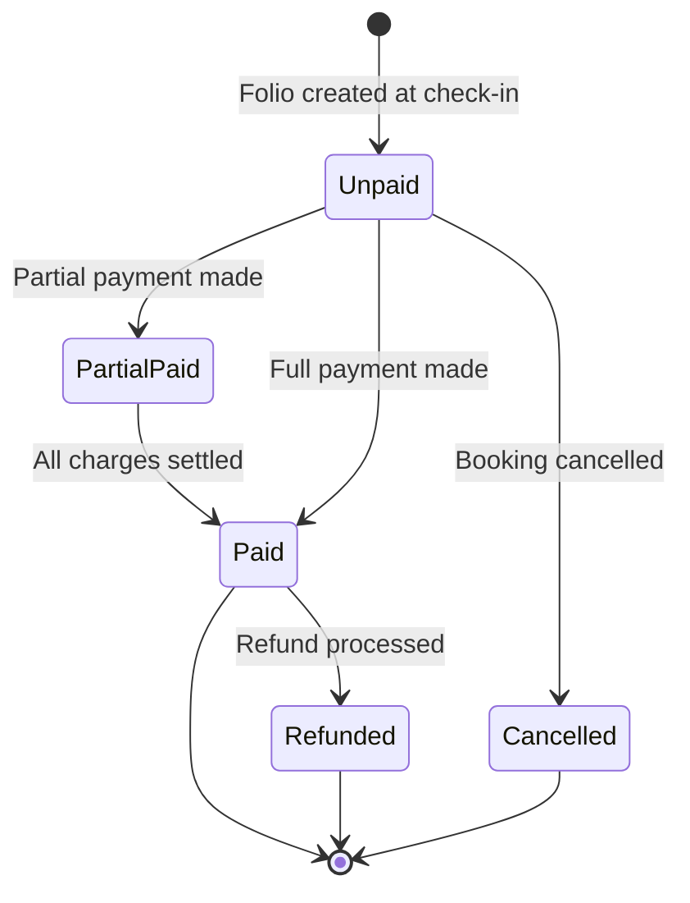
```mermaid
stateDiagram-v2
    [*] --> Unpaid : Folio created at check-in
    Unpaid --> PartialPaid : Partial payment made
    PartialPaid --> Paid : All charges settled
    Unpaid --> Paid : Full payment made
    Paid --> Refunded : Refund processed
    Unpaid --> Cancelled : Booking cancelled
    Paid --> [*]
    Refunded --> [*]
    Cancelled --> [*]
```

---

## **3. Detailed Design**

### **3.1 Auth, Profiles & Master Data**

#### **3.1.1 Class Diagram – Authentication & User Management**

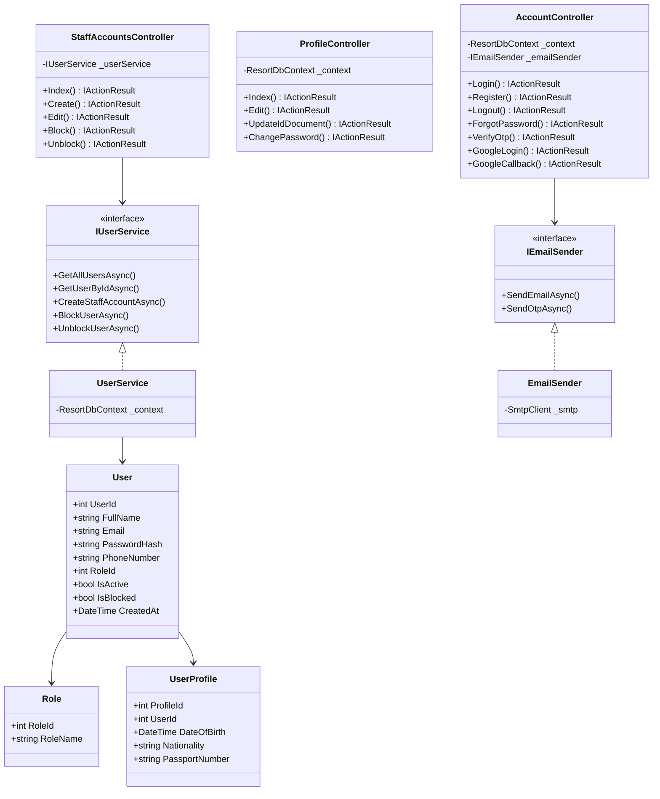
```mermaid
classDiagram
    class AccountController {
        -ResortDbContext _context
        -IEmailSender _emailSender
        +Login() IActionResult
        +Register() IActionResult
        +Logout() IActionResult
        +ForgotPassword() IActionResult
        +VerifyOtp() IActionResult
        +GoogleLogin() IActionResult
        +GoogleCallback() IActionResult
    }

    class ProfileController {
        -ResortDbContext _context
        +Index() IActionResult
        +Edit() IActionResult
        +UpdateIdDocument() IActionResult
        +ChangePassword() IActionResult
    }

    class StaffAccountsController {
        -IUserService _userService
        +Index() IActionResult
        +Create() IActionResult
        +Edit() IActionResult
        +Block() IActionResult
        +Unblock() IActionResult
    }

    class IUserService {
        <<interface>>
        +GetAllUsersAsync()
        +GetUserByIdAsync()
        +CreateStaffAccountAsync()
        +BlockUserAsync()
        +UnblockUserAsync()
    }

    class UserService {
        -ResortDbContext _context
    }

    class IEmailSender {
        <<interface>>
        +SendEmailAsync()
        +SendOtpAsync()
    }

    class EmailSender {
        -SmtpClient _smtp
    }

    class User {
        +int UserId
        +string FullName
        +string Email
        +string PasswordHash
        +string PhoneNumber
        +int RoleId
        +bool IsActive
        +bool IsBlocked
        +DateTime CreatedAt
    }

    class Role {
        +int RoleId
        +string RoleName
    }

    class UserProfile {
        +int ProfileId
        +int UserId
        +DateTime DateOfBirth
        +string Nationality
        +string PassportNumber
    }

    AccountController --> IEmailSender
    StaffAccountsController --> IUserService
    IUserService <|.. UserService
    IEmailSender <|.. EmailSender
    User --> Role
    User --> UserProfile
    UserService --> User
```

#### **3.1.2 Sequence Diagram – User Registration**

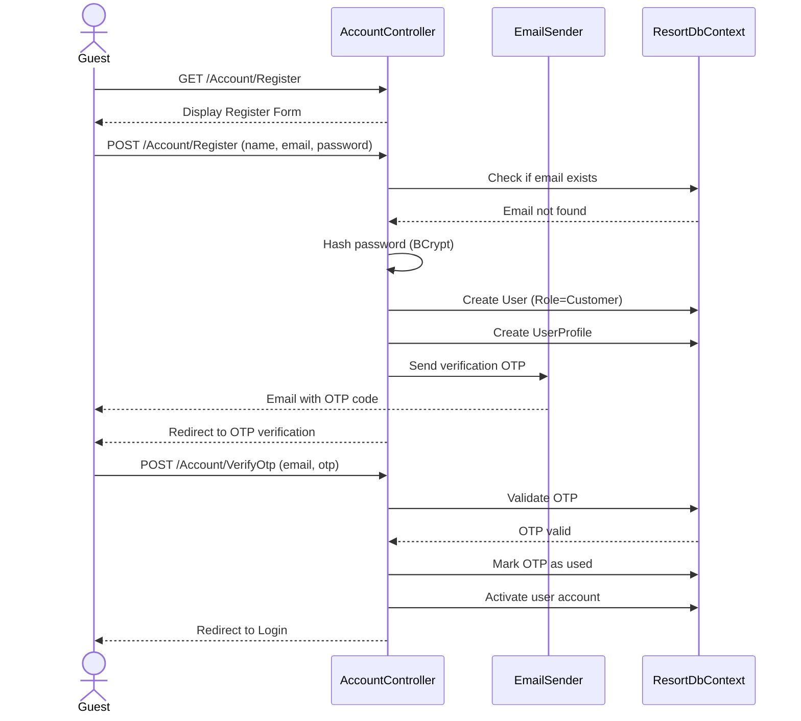
```mermaid
sequenceDiagram
    actor Guest
    participant AC as AccountController
    participant ES as EmailSender
    participant DB as ResortDbContext

    Guest->>AC: GET /Account/Register
    AC-->>Guest: Display Register Form

    Guest->>AC: POST /Account/Register (name, email, password)
    AC->>DB: Check if email exists
    DB-->>AC: Email not found
    AC->>AC: Hash password (BCrypt)
    AC->>DB: Create User (Role=Customer)
    AC->>DB: Create UserProfile
    AC->>ES: Send verification OTP
    ES-->>Guest: Email with OTP code
    AC-->>Guest: Redirect to OTP verification

    Guest->>AC: POST /Account/VerifyOtp (email, otp)
    AC->>DB: Validate OTP
    DB-->>AC: OTP valid
    AC->>DB: Mark OTP as used
    AC->>DB: Activate user account
    AC-->>Guest: Redirect to Login
```

#### **3.1.3 Sequence Diagram – User Login**

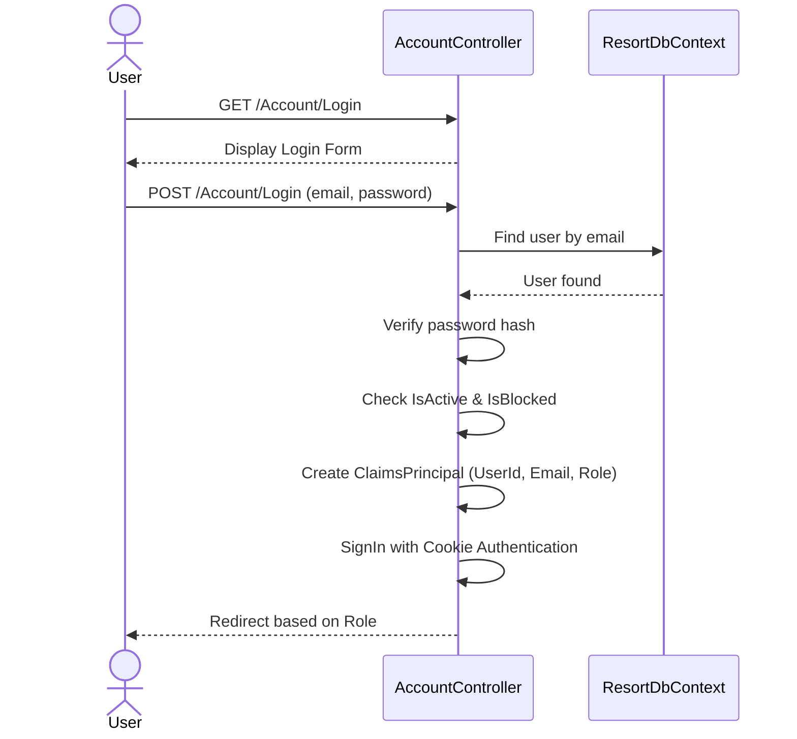
```mermaid
sequenceDiagram
    actor User
    participant AC as AccountController
    participant DB as ResortDbContext

    User->>AC: GET /Account/Login
    AC-->>User: Display Login Form

    User->>AC: POST /Account/Login (email, password)
    AC->>DB: Find user by email
    DB-->>AC: User found
    AC->>AC: Verify password hash
    AC->>AC: Check IsActive & IsBlocked
    AC->>AC: Create ClaimsPrincipal (UserId, Email, Role)
    AC->>AC: SignIn with Cookie Authentication
    AC-->>User: Redirect based on Role
```

#### **3.1.4 Sequence Diagram – Manage Rooms (CRUD)**

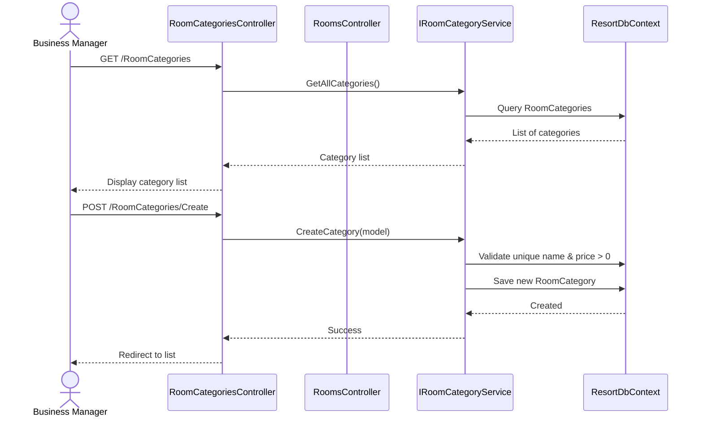
```mermaid
sequenceDiagram
    actor BM as Business Manager
    participant RCC as RoomCategoriesController
    participant RC as RoomsController
    participant SVC as IRoomCategoryService
    participant DB as ResortDbContext

    BM->>RCC: GET /RoomCategories
    RCC->>SVC: GetAllCategories()
    SVC->>DB: Query RoomCategories
    DB-->>SVC: List of categories
    SVC-->>RCC: Category list
    RCC-->>BM: Display category list

    BM->>RCC: POST /RoomCategories/Create
    RCC->>SVC: CreateCategory(model)
    SVC->>DB: Validate unique name & price > 0
    SVC->>DB: Save new RoomCategory
    DB-->>SVC: Created
    SVC-->>RCC: Success
    RCC-->>BM: Redirect to list
```

---

### **3.2 Room Reservation & Front Desk**

#### **3.2.1 Class Diagram – Booking & Reception**

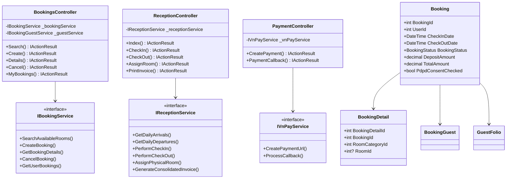
```mermaid
classDiagram
    class BookingsController {
        -IBookingService _bookingService
        -IBookingGuestService _guestService
        +Search() IActionResult
        +Create() IActionResult
        +Details() IActionResult
        +Cancel() IActionResult
        +MyBookings() IActionResult
    }

    class ReceptionController {
        -IReceptionService _receptionService
        +Index() IActionResult
        +CheckIn() IActionResult
        +CheckOut() IActionResult
        +AssignRoom() IActionResult
        +PrintInvoice() IActionResult
    }

    class PaymentController {
        -IVnPayService _vnPayService
        +CreatePayment() IActionResult
        +PaymentCallback() IActionResult
    }

    class IBookingService {
        <<interface>>
        +SearchAvailableRooms()
        +CreateBooking()
        +GetBookingDetails()
        +CancelBooking()
        +GetUserBookings()
    }

    class IReceptionService {
        <<interface>>
        +GetDailyArrivals()
        +GetDailyDepartures()
        +PerformCheckIn()
        +PerformCheckOut()
        +AssignPhysicalRoom()
        +GenerateConsolidatedInvoice()
    }

    class IVnPayService {
        <<interface>>
        +CreatePaymentUrl()
        +ProcessCallback()
    }

    class Booking {
        +int BookingId
        +int UserId
        +DateTime CheckInDate
        +DateTime CheckOutDate
        +BookingStatus BookingStatus
        +decimal DepositAmount
        +decimal TotalAmount
        +bool PdpdConsentChecked
    }

    class BookingDetail {
        +int BookingDetailId
        +int BookingId
        +int RoomCategoryId
        +int? RoomId
    }

    BookingsController --> IBookingService
    ReceptionController --> IReceptionService
    PaymentController --> IVnPayService
    Booking --> BookingDetail
    Booking --> BookingGuest
    Booking --> GuestFolio
```

#### **3.2.2 Sequence Diagram – Book Room**

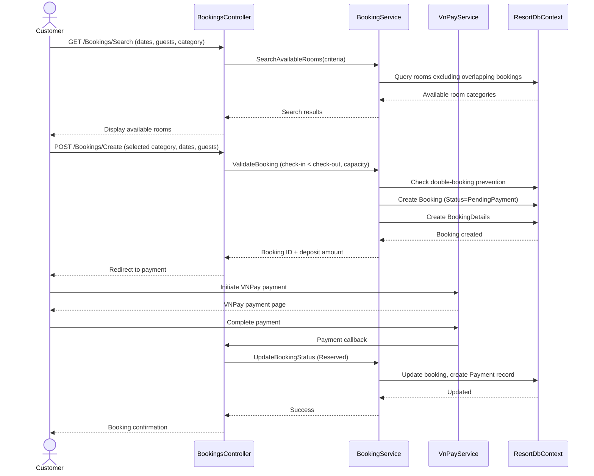
```mermaid
sequenceDiagram
    actor Customer
    participant BC as BookingsController
    participant BS as BookingService
    participant PS as VnPayService
    participant DB as ResortDbContext

    Customer->>BC: GET /Bookings/Search (dates, guests, category)
    BC->>BS: SearchAvailableRooms(criteria)
    BS->>DB: Query rooms excluding overlapping bookings
    DB-->>BS: Available room categories
    BS-->>BC: Search results
    BC-->>Customer: Display available rooms

    Customer->>BC: POST /Bookings/Create (selected category, dates, guests)
    BC->>BS: ValidateBooking (check-in < check-out, capacity)
    BS->>DB: Check double-booking prevention
    BS->>DB: Create Booking (Status=PendingPayment)
    BS->>DB: Create BookingDetails
    DB-->>BS: Booking created
    BS-->>BC: Booking ID + deposit amount
    BC-->>Customer: Redirect to payment

    Customer->>PS: Initiate VNPay payment
    PS-->>Customer: VNPay payment page
    Customer->>PS: Complete payment
    PS->>BC: Payment callback
    BC->>BS: UpdateBookingStatus (Reserved)
    BS->>DB: Update booking, create Payment record
    DB-->>BS: Updated
    BS-->>BC: Success
    BC-->>Customer: Booking confirmation
```

#### **3.2.3 Sequence Diagram – Check-In**

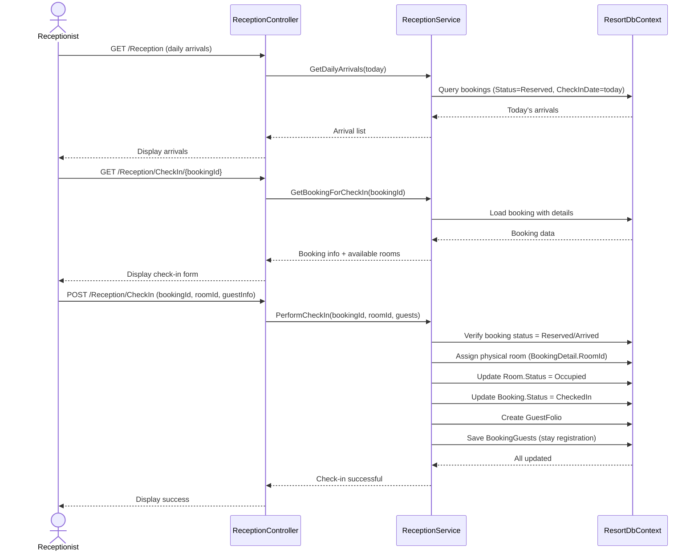
```mermaid
sequenceDiagram
    actor Receptionist
    participant RC as ReceptionController
    participant RS as ReceptionService
    participant DB as ResortDbContext

    Receptionist->>RC: GET /Reception (daily arrivals)
    RC->>RS: GetDailyArrivals(today)
    RS->>DB: Query bookings (Status=Reserved, CheckInDate=today)
    DB-->>RS: Today's arrivals
    RS-->>RC: Arrival list
    RC-->>Receptionist: Display arrivals

    Receptionist->>RC: GET /Reception/CheckIn/{bookingId}
    RC->>RS: GetBookingForCheckIn(bookingId)
    RS->>DB: Load booking with details
    DB-->>RS: Booking data
    RS-->>RC: Booking info + available rooms
    RC-->>Receptionist: Display check-in form

    Receptionist->>RC: POST /Reception/CheckIn (bookingId, roomId, guestInfo)
    RC->>RS: PerformCheckIn(bookingId, roomId, guests)
    RS->>DB: Verify booking status = Reserved/Arrived
    RS->>DB: Assign physical room (BookingDetail.RoomId)
    RS->>DB: Update Room.Status = Occupied
    RS->>DB: Update Booking.Status = CheckedIn
    RS->>DB: Create GuestFolio
    RS->>DB: Save BookingGuests (stay registration)
    DB-->>RS: All updated
    RS-->>RC: Check-in successful
    RC-->>Receptionist: Display success
```

#### **3.2.4 Sequence Diagram – Check-Out**

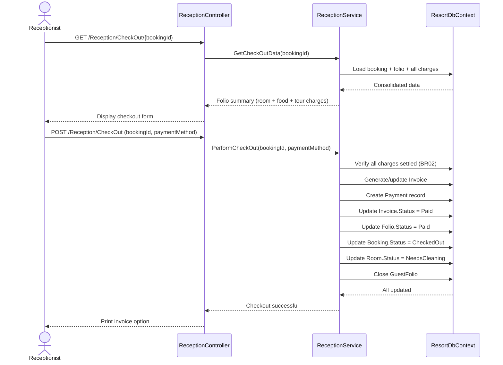
```mermaid
sequenceDiagram
    actor Receptionist
    participant RC as ReceptionController
    participant RS as ReceptionService
    participant DB as ResortDbContext

    Receptionist->>RC: GET /Reception/CheckOut/{bookingId}
    RC->>RS: GetCheckOutData(bookingId)
    RS->>DB: Load booking + folio + all charges
    DB-->>RS: Consolidated data
    RS-->>RC: Folio summary (room + food + tour charges)
    RC-->>Receptionist: Display checkout form

    Receptionist->>RC: POST /Reception/CheckOut (bookingId, paymentMethod)
    RC->>RS: PerformCheckOut(bookingId, paymentMethod)
    RS->>DB: Verify all charges settled (BR02)
    RS->>DB: Generate/update Invoice
    RS->>DB: Create Payment record
    RS->>DB: Update Invoice.Status = Paid
    RS->>DB: Update Folio.Status = Paid
    RS->>DB: Update Booking.Status = CheckedOut
    RS->>DB: Update Room.Status = NeedsCleaning
    RS->>DB: Close GuestFolio
    DB-->>RS: All updated
    RS-->>RC: Checkout successful
    RC-->>Receptionist: Print invoice option
```

---

### **3.3 Restaurant POS & Room Service**

#### **3.3.1 Class Diagram – Food Orders & KOT**

```mermaid
classDiagram
    class FoodOrdersController {
        -IFoodOrderService _foodOrderService
        +Index() IActionResult
        +Create() IActionResult
        +UpdateStatus() IActionResult
        +ChargeToRoom() IActionResult
    }

    class TableFoodOrdersController {
        -ITableFoodOrderService _service
        +Index() IActionResult
        +Create() IActionResult
        +UpdateStatus() IActionResult
    }

    class IFoodOrderService {
        <<interface>>
        +GetOrders()
        +CreateRoomServiceOrder()
        +UpdateOrderStatus()
        +ChargeToRoom()
    }

    class IKotService {
        <<interface>>
        +GetPendingKots()
        +UpdateKotStatus()
    }

    class FoodOrder {
        +int FoodOrderId
        +FoodOrderType OrderType
        +int? BookingId
        +FoodOrderStatus OrderStatus
        +decimal TotalAmount
        +bool IsChargedToRoom
    }

    class Kot {
        +int KotId
        +int FoodOrderId
        +KotStatus Status
    }

    FoodOrdersController --> IFoodOrderService
    FoodOrder --> Kot : 1..1
    FoodOrder --> FoodOrderItem : 1..*
```

#### **3.3.2 Sequence Diagram – Order Food to Room**

```mermaid
sequenceDiagram
    actor Customer
    participant FOC as FoodOrdersController
    participant FOS as FoodOrderService
    participant KS as KotService
    participant DB as ResortDbContext

    Customer->>FOC: GET /FoodOrders/Create (view menu)
    FOC->>FOS: GetAvailableMenuItems()
    FOS->>DB: Query MenuItems (IsAvailable=true)
    DB-->>FOS: Available items
    FOS-->>FOC: Menu items
    FOC-->>Customer: Display room service menu

    Customer->>FOC: POST /FoodOrders/Create (items, quantities, notes)
    FOC->>FOS: CreateRoomServiceOrder(bookingId, items)
    FOS->>DB: Verify customer is CheckedIn
    FOS->>DB: Verify room is Occupied
    FOS->>DB: Snapshot menu item prices
    FOS->>DB: Create FoodOrder (Status=Pending)
    FOS->>DB: Create FoodOrderItems
    FOS->>DB: Create KOT (Status=Pending)
    DB-->>FOS: Order created
    FOS-->>FOC: Order confirmation
    FOC-->>Customer: Order placed successfully
```

#### **3.3.3 Sequence Diagram – Charge Food to Room**

```mermaid
sequenceDiagram
    actor FBStaff as F&B Staff
    participant FOC as FoodOrdersController
    participant FOS as FoodOrderService
    participant DB as ResortDbContext

    FBStaff->>FOC: POST /FoodOrders/ChargeToRoom (orderId)
    FOC->>FOS: ChargeToRoom(orderId)
    FOS->>DB: Verify order status = Delivered
    FOS->>DB: Verify IsChargedToRoom = false (prevent duplicate)
    FOS->>DB: Verify room has checked-in guest
    FOS->>DB: Update FoodOrder.IsChargedToRoom = true
    FOS->>DB: Create FolioTransaction (type=FoodCharge)
    FOS->>DB: Update GuestFolio.TotalFoodCharges
    DB-->>FOS: Charged successfully
    FOS-->>FOC: Success
    FOC-->>FBStaff: Charge confirmed
```

---

### **3.4 Tour Booking & Feedback System**

#### **3.4.1 Class Diagram – Tour Management**

```mermaid
classDiagram
    class ToursController {
        -ITourCatalogService _tourService
        +Index() IActionResult
        +Create() IActionResult
        +Edit() IActionResult
        +Details() IActionResult
    }

    class CustomerTourBookingController {
        -ICustomerTourBookingService _service
        +Index() IActionResult
        +Book() IActionResult
        +Cancel() IActionResult
        +MyBookings() IActionResult
    }

    class ReviewController {
        -IReviewService _reviewService
        +Index() IActionResult
        +Create() IActionResult
        +Approve() IActionResult
        +Hide() IActionResult
    }

    class ITourCatalogService {
        <<interface>>
        +GetAllTours()
        +CreateTour()
        +UpdateTour()
    }

    class ICustomerTourBookingService {
        <<interface>>
        +BookTour()
        +CancelTourBooking()
        +GetMyTourBookings()
    }

    class IReviewService {
        <<interface>>
        +GetReviews()
        +CreateReview()
        +ApproveReview()
        +HideReview()
    }

    ToursController --> ITourCatalogService
    CustomerTourBookingController --> ICustomerTourBookingService
    ReviewController --> IReviewService
```

#### **3.4.2 Sequence Diagram – Book Tour**

```mermaid
sequenceDiagram
    actor Customer
    participant CTBC as CustomerTourBookingController
    participant TBS as CustomerTourBookingService
    participant DB as ResortDbContext

    Customer->>CTBC: GET /CustomerTourBooking (browse tours)
    CTBC->>TBS: GetAvailableTours()
    TBS->>DB: Query Tours + TourSchedules (Active, future dates)
    DB-->>TBS: Available tours with schedules
    TBS-->>CTBC: Tour list
    CTBC-->>Customer: Display tour catalog

    Customer->>CTBC: POST /CustomerTourBooking/Book (scheduleId, participants)
    CTBC->>TBS: BookTour(userId, scheduleId, participants)
    TBS->>DB: Validate schedule is Active
    TBS->>DB: Validate participants > 0
    TBS->>DB: Validate participants <= AvailableSlots
    TBS->>DB: Create TourBooking (Status=Pending)
    TBS->>DB: Decrease TourSchedule.AvailableSlots
    DB-->>TBS: Booking created
    TBS-->>CTBC: Tour booking confirmation
    CTBC-->>Customer: Redirect to payment
```

---

### **3.5 Consolidated Billing & Dashboards**

#### **3.5.1 Class Diagram – Dashboard & Reporting**

```mermaid
classDiagram
    class DashboardController {
        -ResortDbContext _context
        +Index() IActionResult
        +Revenue() IActionResult
        +Occupancy() IActionResult
        +Export() IActionResult
    }

    class RefundsController {
        -IRefundService _refundService
        +Index() IActionResult
        +Process() IActionResult
    }

    class GuestFolio {
        +int FolioId
        +int BookingId
        +decimal TotalRoomCharges
        +decimal TotalFoodCharges
        +decimal TotalTourCharges
        +decimal TotalAmount
        +FolioStatus Status
    }

    class Invoice {
        +int InvoiceId
        +int FolioId
        +string InvoiceNumber
        +decimal TotalAmount
        +decimal TaxAmount
        +decimal FinalAmount
        +InvoiceStatus InvoiceStatus
    }

    class FolioTransaction {
        +int TransactionId
        +int FolioId
        +FolioTransactionType TransactionType
        +decimal Amount
        +string Description
    }

    GuestFolio --> FolioTransaction : 1..*
    GuestFolio --> Invoice : 1..1
    Invoice --> Payment : 1..*
```

#### **3.5.2 Sequence Diagram – Generate Consolidated Invoice**

```mermaid
sequenceDiagram
    actor Receptionist
    participant RC as ReceptionController
    participant RS as ReceptionService
    participant DB as ResortDbContext

    Receptionist->>RC: Initiate checkout for bookingId
    RC->>RS: GenerateConsolidatedInvoice(bookingId)

    RS->>DB: Get GuestFolio for booking
    RS->>DB: Calculate room charges (price × nights)
    RS->>DB: Sum all food charges (IsChargedToRoom=true)
    RS->>DB: Sum all tour charges
    RS->>DB: Create/Update FolioTransactions

    RS->>RS: TotalAmount = RoomCharges + FoodCharges + TourCharges
    RS->>RS: FinalAmount = TotalAmount + Tax

    RS->>DB: Create Invoice (Status=Draft)
    RS->>DB: Update GuestFolio totals

    DB-->>RS: Invoice created
    RS-->>RC: Invoice summary
    RC-->>Receptionist: Display consolidated invoice

    Note over Receptionist,DB: BR02: Cannot checkout if unpaid charges exist
```

---

> **Document End**
>
> This Software Design Specification covers the high-level architecture, database design, state transitions, and detailed design for all 5 modules of the PhucNguyen Resort & Tour Hub system. All diagrams are based on the actual implementation in the ASP.NET Core MVC codebase.
